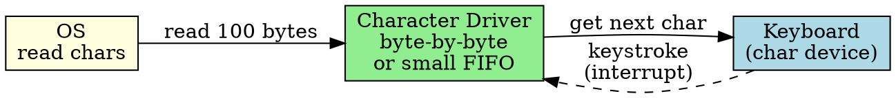
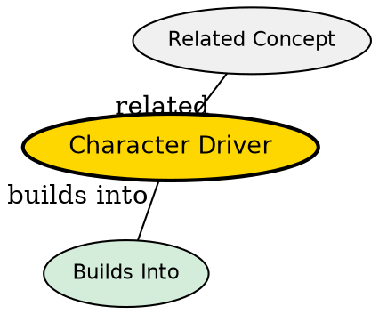

## The Problem

Character devices (keyboard, mouse, serial port) transfer data as a stream of bytes, one at a time, with no random access. The driver must handle sequential, unbuffered transfers.

## Core Idea

A character driver handles byte-stream devices, managing sequential data transfer one character/byte at a time, without seeking or block structure.

## How It Works

1. OS sends read/write request for character data
2. Driver reads/writes bytes sequentially from device
3. Typically uses small buffers (one character or small FIFO)
4. Interrupt per character (or small group) is common
5. No seeking -- data is a sequential stream

## Key Properties

- Transfers one byte or small buffers at a time
- No seeking -- sequential access only
- Examples: keyboard, mouse, serial port, printer
- Often uses interrupts per character (can be high overhead)

## Semantic Network

## Connections

- **Built from:** [[device-driver|Device Driver]], [[io-devices|I/O Devices]]
- **Builds into:** [[io-software-structure|I/O Software Structure]]
- **Related:** [[block-driver|Block Driver]], [[interrupt-handler|Interrupt Handler]]
- **Contrasts with:** [[block-driver|Block Driver]] (random access vs sequential)

## Edge Cases & Gotchas

- High interrupt rate for fast character streams (use FIFO buffers)
- Some character devices support limited "seek" (e.g., tape drives)
- Character devices don't support memory-mapped I/O typically