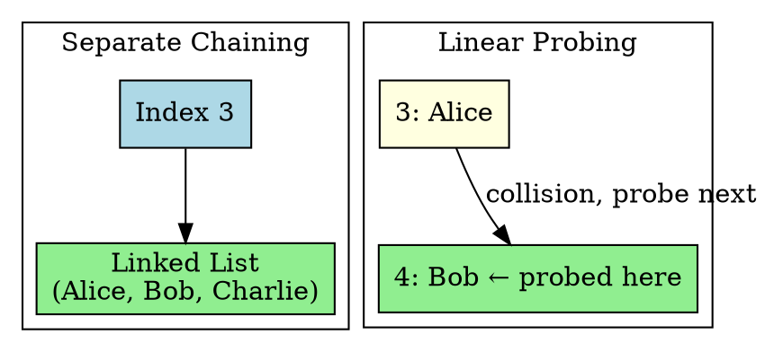
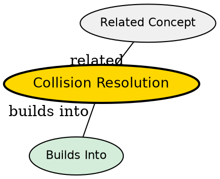

## The Problem

Two different keys may hash to the same index (collision). The hash table needs a strategy to store both values at the same index.

## Core Idea

Collision resolution techniques handle cases where multiple keys map to the same hash table index, using either chaining (linked lists) or probing (search for next available slot).

## How It Works

Two main approaches:

**1. Separate Chaining**: Each index has a linked list of all key-value pairs that hashed there
**2. Open Addressing (Probing)**: Find another empty slot using a probe sequence

## Key Properties

- **Separate Chaining**: Simple, performance degrades with long chains
- **Linear Probing**: Fast when table isn't full, but causes clustering
- **Quadratic Probing**: Reduces clustering, but may not probe all slots
- **Double Hashing**: Uses second hash function, best open addressing method

## Semantic Network

## Connections

- **Built from:** [[hashing|Hashing]], [[hash-function|Hash Function]]
- **Builds into:** [[separate-chaining|Separate Chaining]], [[linear-probing|Linear Probing]]
- **Related:** [[double-hashing|Double Hashing]], [[quadratic-probing|Quadratic Probing]]
- **Contrasts with:** [[hash-function|Hash Function]] (prevents vs handles collisions)

## Edge Cases & Gotchas

- Long chains in chaining → degrades to O(n) search
- Clustering in probing → many consecutive occupied slots
- Deletion in open addressing is tricky (can't just remove, need tombstones)
- Load factor > 0.7 → performance drops sharply