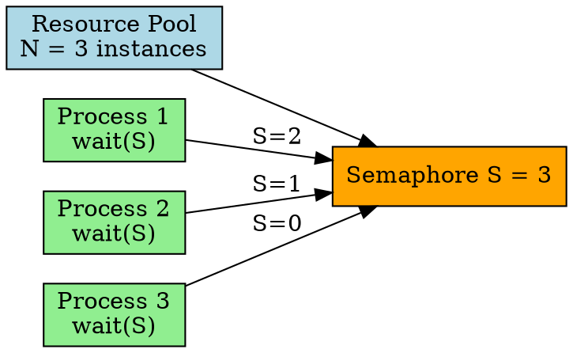

## The Problem

Some resources have multiple identical instances (e.g., 3 printers, 5 buffer slots). Binary semaphore can't handle this — we need to track how many instances are available.

## Core Idea

A counting semaphore can take values 0 to N, where N is the number of available resources in the pool.

## How It Works

1. Initialize semaphore to N (number of available resources)
2. Process requests resource: `wait(S)` → S--
3. If S becomes negative, process blocks (no resources available)
4. Process releases: `signal(S)` → S++, wake up a blocked process

## Key Properties

- Value range: 0 to N (N = resource count)
- Used for resource management (buffer slots, printer pool)
- Negative value = number of blocked processes
- Classic use: producer-consumer bounded buffer

## Connections

- **Built from:** [[semaphore|Semaphore]], [[producer-consumer|Producer-Consumer Problem]]
- **Builds into:** [[reader-writer|Reader-Writer Problem]]
- **Related:** [[binary-semaphore|Binary Semaphore]]
- **Contrasts with:** [[mutex|Mutex]] (mutex is just binary semaphore)

## Edge Cases & Gotchas

- Initializing to wrong N causes resource leaks or errors
- Must ensure signal() is called exactly once per wait()
- Priority inversion can happen with multiple priority levels