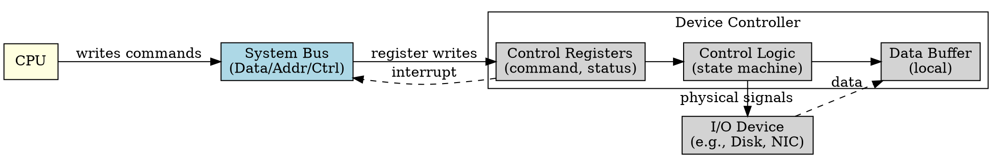

## The Problem

The CPU cannot directly manipulate hardware signals (move disk arm, read magnetic flux). It needs a hardware intermediary that understands both the CPU's bus interface and the device's physical interface.

## Core Idea

A device controller is a hardware component that interfaces between the system bus and the physical I/O device, containing registers for commands, data, and status, plus local buffers for data transfer.

## How It Works

1. CPU (via driver) writes commands and parameters to controller's registers
2. Controller parses registers to determine operation (read/write/seek)
3. Controller executes operation on the physical device
4. Data transfers to/from controller's local buffer
5. Controller raises interrupt when operation completes
6. CPU reads status register to check success/failure

## Key Properties

- Contains three types of registers: control, data, and status
- Has local buffer to hold data during transfer
- Can operate asynchronously from CPU (using DMA)
- Sits on the system bus, addressed like memory (memory-mapped I/O)

## Connections

- **Built from:** [[system-bus|System Bus]], [[io-system|I/O System]]
- **Builds into:** [[io-request-to-hardware|I/O Request to Hardware Operation]]
- **Related:** [[device-driver|Device Driver]], [[dma|DMA]], [[interrupt-handler|Interrupt Handler]]
- **Contrasts with:** [[device-driver|Device Driver]] (software vs hardware)

## Edge Cases & Gotchas

- Register addresses vary by device — driver must know the correct addresses
- Local buffer size limits transfer size per operation
- Status register must be read before another command is issued
- Some controllers have buggy implementations causing race conditions