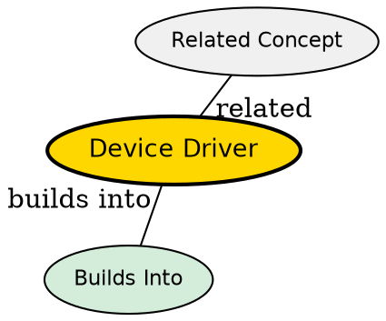

## The Problem

Each hardware device has unique control mechanisms, register layouts, and command sets. The OS cannot contain code for every possible device -- it would be enormous and impossible to maintain.

## Core Idea

A device driver is a software module that translates generic OS I/O commands into device-specific instructions, acting as the intermediary between the OS and hardware.

## How It Works

1. OS sends a generic I/O request (e.g., "read sector 120") to the driver
2. Driver translates this into device-specific commands and register writes
3. Driver writes commands to the device controller's registers
4. Driver may set up DMA transfers or prepare for interrupt notification
5. On completion, driver processes the interrupt and updates OS state

```dot
digraph device_driver {
  rankdir=LR;
  node [shape=box, style=filled];
  
  OS [label="Operating System", fillcolor=lightyellow];
  Driver [label="Device Driver\n(Software)", fillcolor=lightgreen];
  Regs [label="Device Controller\nRegisters", fillcolor=orange];
  Device [label="Physical\nDevice", fillcolor=lightgray];
  
  OS -> Driver [label="generic command\n(e.g., read sector)"];
  Driver -> Regs [label="specific commands\n& register writes"];
  Regs -> Device [label="hardware signals"];
  Device -> Regs [label="status/interrupt", style=dashed];
  Regs -> Driver [label="interrupt", style=dashed];
  Driver -> OS [label="completion status", style=dashed];
}
```

## Key Properties

- Runs in kernel mode with privileged access
- Device-specific but presents uniform interface to OS
- Handles device initialization, error detection, and status reporting
- Four main types: character, block, network, and virtual drivers

## Semantic Network

## Connections

- **Built from:** [[io-system|I/O System]], [[device-controller|Device Controller]]
- **Builds into:** [[io-request-to-hardware|I/O Request to Hardware Operation]], [[io-software-structure|I/O Software Structure]]
- **Related:** [[character-driver|Character Driver]], [[block-driver|Block Driver]], [[network-driver|Network Driver]]
- **Contrasts with:** [[user-level-io-software|User-Level I/O Software]] (lives in user space, not kernel)

## Edge Cases & Gotchas

- A buggy driver can cause kernel panics or system crashes
- Driver must handle concurrent requests properly (reentrant code)
- Missing drivers result in "unknown device" errors
- Driver version must match kernel version exactly