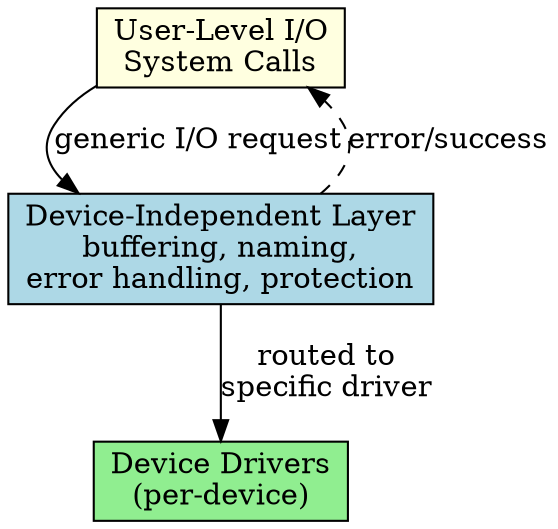

## The Problem

Different devices have different characteristics (block vs character, seekable vs sequential), but applications want a uniform interface. The OS needs a layer that handles common I/O concerns regardless of device type.

## Core Idea

The I/O software layer that provides a uniform interface to user-level software, handling device naming, protection, buffering, and error reporting independent of specific hardware.

## How It Works

1. Receives I/O request from user-level software
2. Identifies which device to use based on file/device name
3. Manages buffering and caching for efficiency
4. Handles device allocation/deallocation (e.g., exclusive printer access)
5. Reports errors in a consistent way
6. Passes request to the appropriate device driver

## Key Properties

- Makes all devices look the same to upper layers
- Handles naming (/dev/sda, COM1, etc.)
- Manages buffer cache for block devices
- Enforces access control (permissions)

## Connections

- **Built from:** [[io-software-structure|I/O Software Structure]], [[user-level-io-software|User-Level I/O Software]]
- **Builds into:** [[io-request-to-hardware|I/O Request to Hardware Operation]]
- **Related:** [[io-system|I/O System]], [[device-driver|Device Driver]], [[buffering|Buffering]]
- **Contrasts with:** [[interrupt-handler|Interrupt Handler]] (lower layer, device-specific events)

## Edge Cases & Gotchas

- Buffer cache size affects performance — too small means frequent disk reads
- Error reporting must be consistent across device types
- Device naming conventions vary by OS (Linux vs Windows)

## Sources

- [[io-summary|I/O System Source Summary]]
