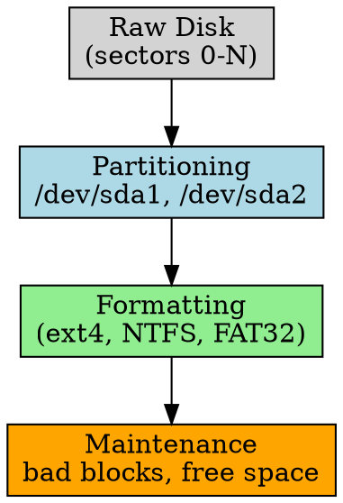

## The Problem

A raw disk is just a collection of sectors — the OS needs to organize it into usable storage: divide it into partitions, create file systems, and handle errors.

## Core Idea

Disk management encompasses partitioning (dividing disks), formatting (creating file systems), and error handling (bad block management).

## How It Works

1. **Partitioning**: Divide disk into logical sections, each can have different file system
2. **Formatting**: Create file system structures (superblock, inodes, bitmaps)
3. **Bad Block Management**: Detect and remap damaged sectors
4. **Free Space Management**: Track unused sectors for new allocations

## Key Properties

- Partition table types: MBR (old, 2TB limit) vs GPT (modern, no practical limit)
- Formatting writes file system metadata (superblock, inode tables)
- Bad blocks detected at format time or during runtime
- File system choice affects performance and features

## Connections

- **Built from:** [[disk-structure|Disk Structure]], [[disk-scheduling|Disk Scheduling]]
- **Builds into:** [[swap-space|Swap Space]], [[raid|RAID]]
- **Related:** [[partitioning|Partitioning]], [[formatting|Formatting]], [[bad-block|Bb Block Management]]
- **Contrasts with:** [[io-system|I/O System]] (higher-level abstraction)

## Edge Cases & Gotchas

- Formatting erases all data — always backup first
- Some file systems (ZFS) do their own bad block management
- Partition alignment matters for SSD performance (4K alignment)

## Sources

- [[io-summary|I/O System Source Summary]]
