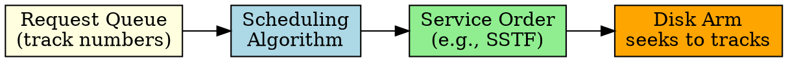

## The Problem

Disk access is slow (milliseconds) compared to CPU/RAM (nanoseconds). The mechanical seek time (moving the disk arm) dominates. With multiple I/O requests, the order of servicing them greatly affects performance.

## Core Idea

Disk scheduling algorithms decide the order to service pending I/O requests to minimize seek time and improve throughput.

## How It Works

Common algorithms:

1. **FCFS**: Process requests in arrival order (simple, but can be slow)
2. **SSTF**: Pick closest request first (minimizes seek, but may starve)
3. **SCAN (Elevator)**: Move in one direction, service requests, reverse at end
4. **C-SCAN**: Like SCAN but only services in one direction, jumps back
5. **LOOK/C-LOOK**: Like SCAN/C-SCAN but stops at last request (not end of disk)

## Key Properties

- SSTF reduces average seek but can starve distant requests
- SCAN gives uniform wait times (like elevator algorithm)
- C-SCAN provides more uniform wait than SCAN
- LOOK is more efficient (doesn't go to disk end unnecessarily)

## Connections

- **Built from:** [[disk-structure|Disk Structure]], [[io-system|I/O System]]
- **Builds into:** [[disk-management|Disk Management]]
- **Related:** [[fcfs|FCFS]], [[sstf|SSTF]], [[scan-scheduling|SCAN]], [[c-scan|C-SCAN]]
- **Contrasts with:** [[swap-space|Swap Space]] (different disk usage pattern)

## Edge Cases & Gotchas

- SSTF can cause starvation for requests at disk edges
- Request merging (adjacent sectors) can improve throughput
- Modern disks do their own scheduling (NCQ) — OS scheduling may be ignored

## Sources

- [[io-summary|I/O System Source Summary]]
