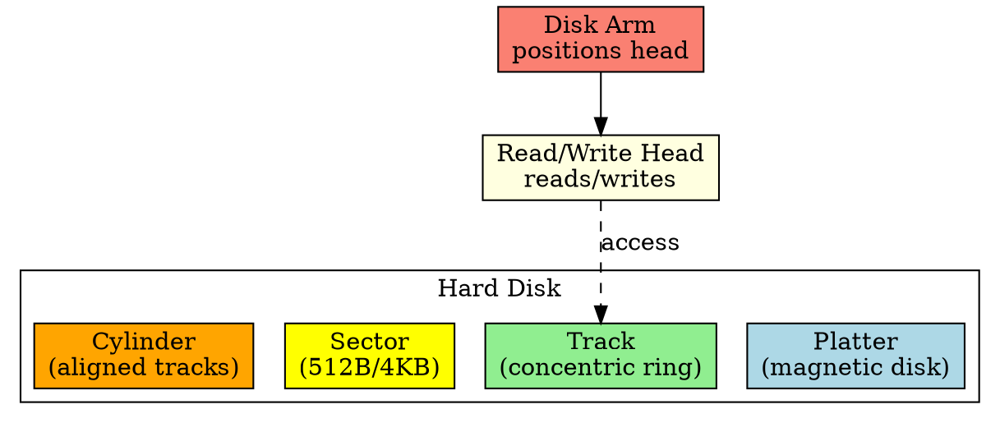

## The Problem

Data on a hard disk isn't stored as a linear sequence — it's physically organized on spinning platters with magnetic surfaces. The OS needs to understand this geometry to efficiently locate and access data.

## Core Idea

A hard disk consists of platters, tracks, sectors, cylinders, and read/write heads — the physical organization that determines how data is addressed and accessed.

## How It Works

A hard disk is organized as:

1. **Platters**: Circular magnetic disks stacked on a spindle
2. **Tracks**: Concentric rings on each platter surface
3. **Sectors**: Smallest storage unit on a track (typically 512B or 4KB)
4. **Cylinder**: Set of aligned tracks across all platters
5. **Read/Write Head**: Moves across platters to access data
6. **Disk Arm**: Moves heads to the correct track

## Key Properties

- Data addressed by CHS: Cylinder, Head, Sector
- Access time = seek time + rotational delay + transfer time
- Tracks are numbered from outer (0) to inner
- Multiple platters increase capacity without increasing form factor

## Connections

- **Built from:** [[io-devices|I/O Devices]], [[block-driver|Block Driver]]
- **Builds into:** [[disk-scheduling|Disk Scheduling]], [[disk-management|Disk Management]]
- **Related:** [[cylinder|Cylinder]], [[track|Track]], [[sector|Sector]]
- **Contrasts with:** [[ssd|SSD]] (no moving parts, different structure)

## Edge Cases & Gotchas

- Sectors aren't always 512B — modern disks use 4KB physical sectors
- Zone bit recording: outer tracks have more sectors than inner tracks
- Bad sectors must be remapped (handled by disk firmware)