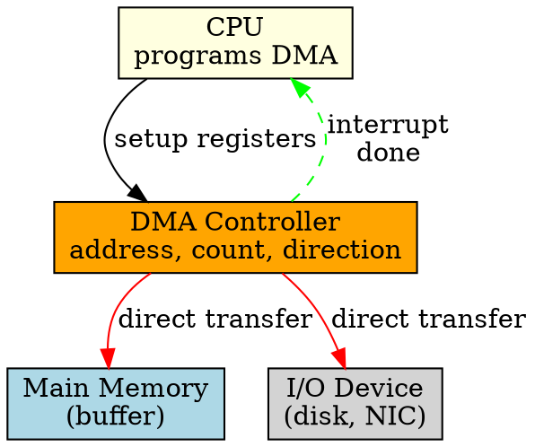

## The Problem

In normal I/O, the CPU must transfer each byte/word between device and memory. For large transfers (disk reads, network packets), this wastes CPU cycles on simple copy operations.

## Core Idea

DMA allows I/O devices to transfer data directly to/from memory without CPU intervention, freeing the CPU for other tasks during data transfer.

## How It Works

1. CPU programs the DMA controller: memory address, transfer size, direction (read/write)
2. DMA controller takes control of the system bus
3. Device transfers data directly to/from memory via DMA
4. DMA controller increments address and decrements count for each transfer
5. When transfer completes, DMA raises an interrupt to notify CPU

## Key Properties

- Transfers data at memory bus speeds (very fast)
- CPU is free during transfer (can run other processes)
- Requires DMA controller hardware (additional cost)
- Best for high-speed, large block transfers

## Connections

- **Built from:** [[io-system|I/O System]], [[system-bus|System Bus]], [[device-controller|Device Controller]]
- **Builds into:** [[io-request-to-hardware|I/O Request to Hardware Operation]]
- **Related:** [[polling|Polling]], [[interrupt-handler|Interrupt Handler]]
- **Contrasts with:** [[user-level-io-software|User-Level I/O Software]] (CPU still involved in non-DMA I/O)

## Edge Cases & Gotchas

- DMA and CPU both need system bus — bus arbitration required
- Wrong DMA setup (bad address/size) can corrupt memory
- Some systems have limited DMA channels (resource contention)
- Cache coherency issues — CPU cache may not see DMA-written data