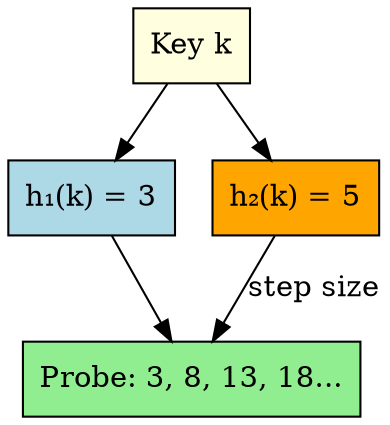

## The Problem

Quadratic probing still has secondary clustering (keys with same initial hash follow same probe sequence). We need a way to give each key a unique probe sequence.

## Core Idea

Double hashing uses two hash functions: the second hash determines the step size for probing, giving each key a unique probe sequence.

## How It Works

1. Compute h₁(k) = initial position
2. Compute h₂(k) = step size (must be non-zero)
3. Probe sequence: h₁(k), h₁(k)+h₂(k), h₁(k)+2h₂(k), ...
4. Each key has different step size → different probe sequence

## Key Properties

- Best open addressing method (least clustering)
- Probes all slots if table size is prime and h₂(k) is non-zero
- More computation (two hash functions)
- Step size must be non-zero and relatively prime to table size

## Connections

- **Built from:** [[hashing|Hashing]], [[hash-function|Hash Function]]
- **Builds into:** [[collision-resolution|Collision Resolution]]
- **Related:** [[linear-probing|Linear Probing]], [[quadratic-probing|Quadratic Probing]]
- **Contrasts with:** [[quadratic-probing|Quadratic Probing]] (two hashes vs one quadratic)

## Edge Cases & Gotchas

- h₂(k) must never be 0 (would infinite loop)
- Table size should be prime for complete coverage
- Most complex to implement of the three probing methods

## Sources

- [[io-summary|I/O System Source Summary]]
