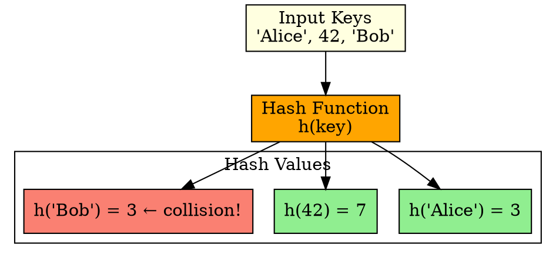

## The Problem

We need a deterministic way to convert arbitrary-sized keys (strings, numbers) into fixed-size array indices for O(1) lookup.

## Core Idea

A hash function maps keys to integer values (array indices) such that equal keys always produce the same hash value, and the distribution is as uniform as possible.

## How It Works

1. Take input key (string, number, object)
2. Apply mathematical transformation (e.g., modulo, multiplication, bit shifting)
3. Output is an integer in range [0, table_size-1]
4. Good hash functions minimize collisions

## Key Properties

- Deterministic: same key → same hash always
- Uniform distribution minimizes collisions
- Fast to compute (shouldn't be slower than the data structure it serves)
- Examples: division method, multiplication method, universal hashing

## Connections

- **Built from:** [[hashing|Hashing]]
- **Builds into:** [[separate-chaining|Separate Chaining]], [[linear-probing|Linear Probing]]
- **Related:** [[collision-resolution|Collision Resolution]], [[load-factor|Load Factor]]
- **Contrasts with:** [[random-number-generator|Random Number Generator]] (hash is deterministic, not random)

## Edge Cases & Gotchas

- Poor hash functions cause clustering (many collisions)
- String hashing must handle variable lengths
- Cryptographic hash functions are overkill for hash tables (too slow)
- Changing hash function requires rehashing entire table

## Sources

- [[io-summary|I/O System Source Summary]]
