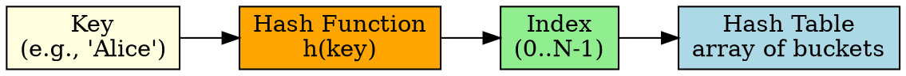

## The Problem

Searching an array or list takes O(n) time. For large datasets, we need O(1) average-case lookup by "scattering" data to computed positions.

## Core Idea

Hashing uses a hash function to map keys to array indices, providing O(1) average-case insert, search, and delete operations.

## How It Works

1. Hash function computes index: `hash(key) % table_size`
2. Key-value pair is stored at that index
3. To search: compute hash of key, go directly to index
4. Collisions (two keys → same index) handled by collision resolution

## Key Properties

- Best/average case: O(1) for insert, search, delete
- Worst case: O(n) when all keys collide
- Performance depends on hash function quality and load factor
- Load factor α = elements / table_size (keep α ≤ 0.7)

## Connections

- **Built from:** [[hash-function|Hash Function]], [[collision-resolution|Collision Resolution]]
- **Builds into:** [[separate-chaining|Separate Chaining]], [[linear-probing|Linear Probing]]
- **Related:** [[load-factor|Load Factor]], [[double-hashing|Double Hashing]]
- **Contrasts with:** [[Private/Daily/computer-science/algorithms/binary-search-tree|Binary Search Tree]] (O(log n) vs average O(1))

## Edge Cases & Gotchas

- Bad hash function causes many collisions → degrades to O(n)
- High load factor (>0.7) dramatically increases collisions
- Rehashing needed when table gets too full
- Worst case: all keys hash to same index

## Sources

- [[io-summary|I/O System Source Summary]]
