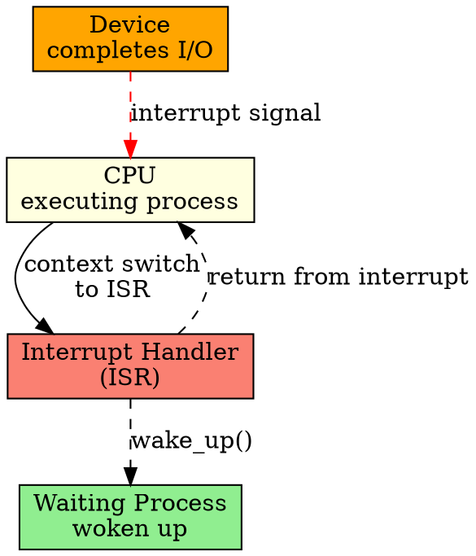

## The Problem

If the CPU polls devices (checks repeatedly if they're done), it wastes cycles when devices are slow. The CPU should be free to do other work while waiting for I/O, and only handle the device when it's actually ready.

## Core Idea

A special function that executes when a device raises an interrupt, allowing the CPU to respond asynchronously to I/O completion without busy-waiting.

## How It Works

1. Device completes operation and raises an interrupt signal on the control bus
2. CPU pauses current work, saves context (registers, program counter)
3. CPU jumps to the interrupt handler (addressed by interrupt vector)
4. Handler reads device status register to confirm completion
5. Handler copies data from device buffer to memory (or vice versa)
6. Handler wakes up any process waiting for this I/O
7. CPU restores context and resumes previous work

## Key Properties

- Runs in kernel mode with high priority
- Must execute quickly (other interrupts may be masked)
- Can't block or sleep (would hang the system)
- Shares data with the interrupted process via kernel structures

## Connections

- **Built from:** [[io-software-structure|I/O Software Structure]], [[device-controller|Device Controller]]
- **Builds into:** [[io-request-to-hardware|I/O Request to Hardware Operation]]
- **Related:** [[io-system|I/O System]], [[polling|Polling]], [[dma|DMA]]
- **Contrasts with:** [[user-level-io-software|User-Level I/O Software]] (runs in user space, not in interrupt context)

## Edge Cases & Gotchas

- Interrupt handlers can't allocate memory or sleep (leads to deadlock)
- Nested interrupts require careful stack management
- Lost interrupts (device interrupts before handler is registered) cause hangs
- Interrupt storms (too many rapid interrupts) can freeze the system

## Sources

- [[io-summary|I/O System Source Summary]]
