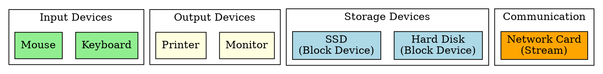

## The Problem

The CPU needs to interact with many different types of external hardware — keyboards, disks, printers, network cards — each with different speeds, data formats, and interfaces. The OS must classify and manage them appropriately.

## Core Idea

I/O devices are classified by their function (input/output/storage/communication) and data transfer mode (block vs character vs stream), determining how the OS handles them.

## How It Works

Devices are classified into:

1. **By function**: Input (keyboard), Output (monitor), Storage (disk), Communication (NIC)
2. **By data transfer**: Block devices (disk, fixed-size blocks), Character devices (keyboard, stream of bytes), Stream devices (audio/video)
3. **By speed**: Slow (keyboard), Medium (disk), Fast (GPU, network)

## Key Properties

- Block devices transfer fixed-size blocks (512B, 4KB), seekable
- Character devices transfer bytes sequentially, not seekable
- Speed varies from very slow (keyboard) to very fast (10GbE NIC)
- Hybrid devices exist (touchscreen = input + output)

## Connections

- **Built from:** [[io-system|I/O System]], [[device-driver|Device Driver]]
- **Builds into:** [[block-driver|Block Driver]], [[character-driver|Character Driver]], [[network-driver|Network Driver]]
- **Related:** [[device-controller|Device Controller]], [[system-bus|System Bus]]
- **Contrasts with:** [[cpu|CPU]] (computes, not I/O)

## Edge Cases & Gotchas

- Some devices are both input and output (touchscreen, modem)
- Block devices may emulate character devices for certain operations
- Device classification blurs with modern hardware (GPU does both compute and output)