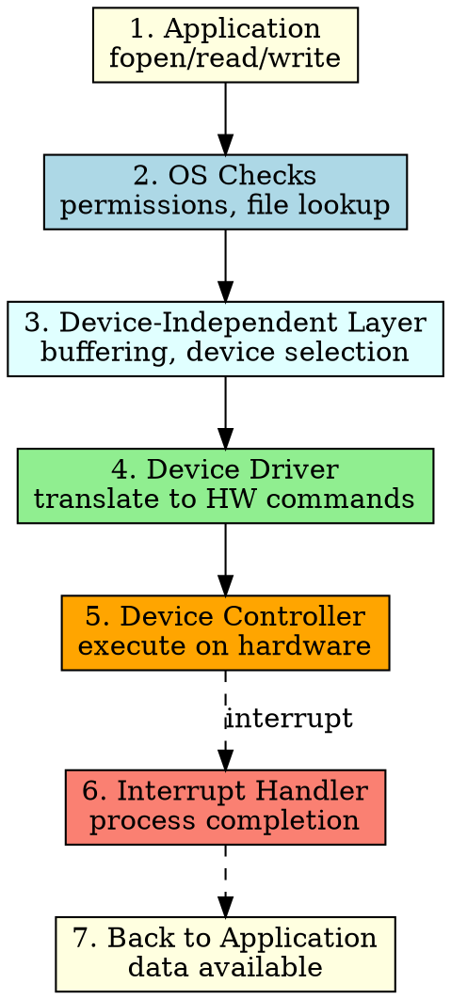

## The Problem

When an application calls `read("data.txt")`, how does this high-level request end up causing a disk head to move and data to appear in memory? The journey from software request to hardware action is complex.

## Core Idea

Transforming an I/O request into hardware operation is a multi-step process where the request flows down through I/O software layers, gets translated into hardware commands, executes on the device, and returns data via interrupts.

## How It Works

1. **Application** calls `fopen("data.txt", "r")` or `read(fd, buf, size)`
2. **OS** checks file permissions, locates file on disk, allocates buffer
3. **Device-Independent Layer** determines which device and driver to use, handles buffering
4. **Device Driver** translates "read sector 120" into register writes for the disk controller
5. **Device Controller** executes: seeks to track, waits for sector, reads data
6. **Interrupt** signals completion; CPU processes interrupt, copies data to user buffer
7. **Application** resumes with data available

## Key Properties

- Each step adds appropriate abstraction or translation
- DMA can bypass CPU involvement in data transfer (steps 5-6)
- The process is asynchronous — application may block until interrupt arrives
- File system layer maps logical file operations to physical disk blocks

## Connections

- **Built from:** [[io-system|I/O System]], [[device-driver|Device Driver]], [[device-controller|Device Controller]]
- **Builds into:** [[dma|DMA]], [[interrupt-handler|Interrupt Handler]]
- **Related:** [[io-software-structure|I/O Software Structure]], [[polling|Polling]], [[system-bus|System Bus]]
- **Contrasts with:** [[user-level-io-software|User-Level I/O Software]] (only handles step 1)

## Edge Cases & Gotchas

- Page fault can occur during copy to user buffer, complicating the flow
- Disk may return errors (bad sector) that must be handled at each layer
- Concurrent I/O requests require proper queue management
- DMA setup failure falls back to programmed I/O (very slow)