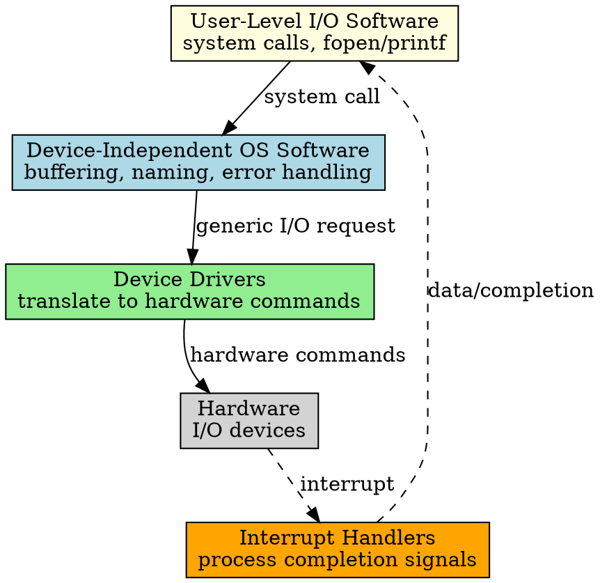

## The Problem

I/O operations involve many concerns: buffering, error handling, device-specific commands, interrupt processing. Putting all this in one place creates unmaintainable code and makes the OS dependent on hardware details.

## Core Idea

I/O software is organized into four layers, each handling a specific abstraction level — from user-facing system calls down to hardware interrupt handling.

## How It Works

The four layers (top to bottom):

1. **User-Level I/O Software**: System calls (`read()`, `write()`, `fopen()`), buffering in user space
2. **Device-Independent OS Software**: Naming, protection, buffering, caching, error reporting
3. **Device Drivers**: Translate generic requests to device-specific commands
4. **Interrupt Handlers**: Process device interrupts and signal completion

## Key Properties

- Each layer only communicates with adjacent layers
- Device-independent layer makes all devices look uniform to applications
- Drivers can be loaded/unloaded without changing the OS
- Modularity enables portability across hardware platforms

## Connections

- **Built from:** [[io-system|I/O System]], [[user-level-io-software|User-Level I/O Software]]
- **Builds into:** [[io-request-to-hardware|I/O Request to Hardware Operation]]
- **Related:** [[device-driver|Device Driver]], [[interrupt-handler|Interrupt Handler]], [[device-independent-io-software|Device-Independent I/O Software]]
- **Contrasts with:** [[device-controller|Device Controller]] (hardware, not software)

## Edge Cases & Gotchas

- Too many layers can impact performance due to context switches
- Device-independent layer must know enough about devices to do buffering correctly
- Error handling must propagate correctly up through all layers
- Some devices bypass layers (e.g., memory-mapped I/O)