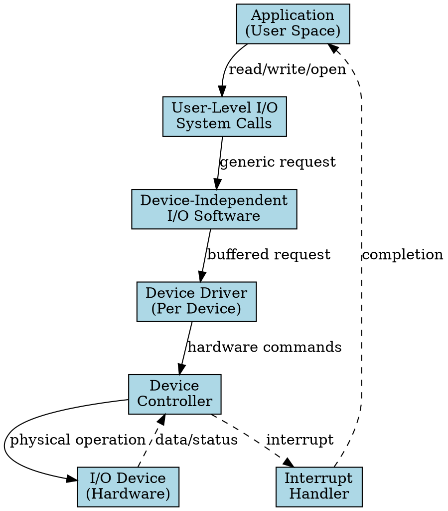

## The Problem

The CPU needs to communicate with external hardware devices (keyboards, disks, printers, network cards), but each device speaks a different "language" with different speeds, data formats, and control mechanisms. Without a unified system, every program would need device-specific code.

## Core Idea

The I/O System is the OS subsystem that manages communication between the CPU and external devices, providing abstraction layers so applications can perform I/O without knowing hardware details.

## How It Works

1. Applications make I/O requests via system calls (`read()`, `write()`, `open()`)
2. The request flows through layered I/O software (user-level → device-independent → device driver → interrupt handler)
3. The device driver translates generic OS commands into device-specific instructions
4. The device controller executes the operation on the physical hardware
5. Completion is signaled via interrupt, and data is returned to the application

## Key Properties

- Provides uniform interface to diverse hardware through abstraction layers
- Handles buffering, caching, and error reporting at device-independent layer
- Uses interrupts to avoid CPU busy-waiting
- Supports multiple I/O techniques: polling, interrupt-driven, DMA

## Connections

- **Built from:** [[system-bus|System Bus]], [[device-driver|Device Driver]], [[interrupt-handler|Interrupt Handler]]
- **Builds into:** [[io-request-to-hardware|I/O Request to Hardware Operation]], [[io-software-structure|I/O Software Structure]]
- **Related:** [[device-controller|Device Controller]], [[dma|DMA]], [[polling|Polling]]
- **Contrasts with:** [[user-level-io-software|User-Level I/O Software]] (one layer in the system)

## Edge Cases & Gotchas

- Device drivers run in kernel mode — a buggy driver can crash the entire OS
- Interrupt storms can overwhelm the CPU if devices generate too many interrupts
- Some devices don't support interrupts and require polling
- DMA conflicts can occur if the DMA controller isn't properly programmed