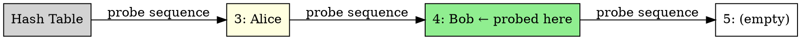

## The Problem

In separate chaining, we need extra memory for linked lists. Can we store everything in the hash table array itself by finding the next empty slot?

## Core Idea

On collision, linear probing checks the next slot (index+1, +2, ...) until an empty slot is found, wrapping around to the beginning if needed.

## How It Works

1. Hash key to get initial index
2. If slot is empty, insert there
3. If occupied, check next slot (index+1)
4. Continue until empty slot found (wrap around if needed)
5. Search: check slots sequentially until key found or empty slot

## Key Properties

- No extra memory for linked lists (all in array)
- Causes primary clustering (consecutive occupied slots)
- Probe sequence is: h(k), h(k)+1, h(k)+2, ...
- Deletion tricky: need tombstone markers

## Connections

- **Built from:** [[hashing|Hashing]], [[collision-resolution|Collision Resolution]]
- **Builds into:** [[quadratic-probing|Quadratic Probing]], [[double-hashing|Double Hashing]]
- **Related:** [[load-factor|Load Factor]]
- **Contrasts with:** [[separate-chaining|Separate Chaining]] (in-table vs chains)

## Edge Cases & Gotchas

- Primary clustering: long runs of occupied slots form
- Performance drops sharply when load factor > 0.7
- Deletion needs tombstones (can't just clear slot)
- Table must be resized when getting full