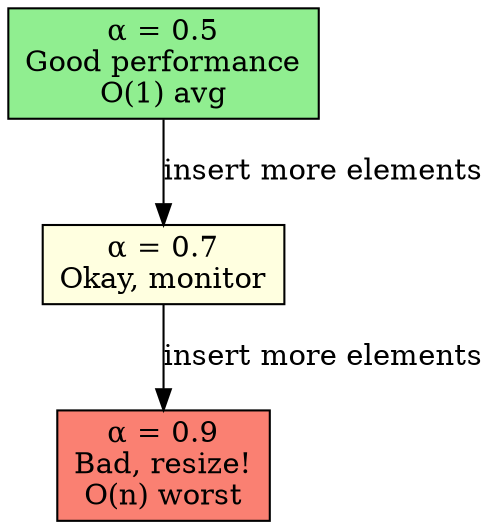

## The Problem

How do we know when a hash table is "too full" and performance will degrade? We need a metric to decide when to resize.

## Core Idea

Load factor (α) is the ratio of elements stored to the total table size: α = number_of_elements / table_size. It predicts hash table performance.

## How It Works

1. Calculate α = n / m (n = elements, m = table size)
2. α ≤ 0.7: good performance, few collisions
3. α > 0.7: performance drops, consider resizing
4. α close to 1.0: many collisions, O(n) worst case likely

## Key Properties

- α = 0.0: empty table (wasted space)
- α = 0.5-0.7: sweet spot for performance
- α > 0.7: collisions increase sharply
- α = 1.0: table full, must resize

## Connections

- **Built from:** [[hashing|Hashing]], [[hash-function|Hash Function]]
- **Builds into:** [[separate-chaining|Separate Chaining]], [[linear-probing|Linear Probing]]
- **Related:** [[collision-resolution|Collision Resolution]]
- **Contrasts with:** [[big-o-notation|Big O Notation]] (load factor affects actual O(1) performance)

## Edge Cases & Gotchas

- Low load factor wastes memory (too many empty slots)
- High load factor causes performance collapse
- Resizing requires rehashing ALL elements (expensive)
- Chaining tolerates higher load factors than probing