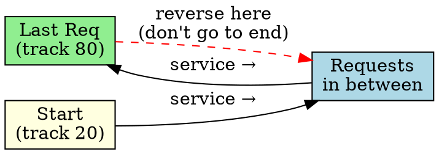

## The Problem

SCAN goes all the way to the disk end even if there are no requests there, wasting time. Can we optimize this?

## Core Idea

LOOK is a variant of SCAN that only goes as far as the last request in each direction, then reverses — doesn't go to disk end unnecessarily.

## How It Works

1. Move disk arm in current direction
2. Service requests along the way
3. When past the last request in that direction, reverse
4. Don't go to physical disk end (unlike SCAN)

## Key Properties

- More efficient than SCAN (no unnecessary travel to disk end)
- Still no starvation (like SCAN)
- Only goes as far as the furthest request
- C-LOOK is the C-SCAN version of LOOK

## Connections

- **Built from:** [[disk-scheduling|Disk Scheduling]], [[scan-scheduling|SCAN]]
- **Builds into:** [[c-look|C-LOOK]]
- **Related:** [[c-scan|C-SCAN]]
- **Contrasts with:** [[scan-scheduling|SCAN]] (stops at last request vs goes to end)

## Edge Cases & Gotchas

- Must track the furthest request in each direction
- Slightly more complex than SCAN
- Default in many modern OSs

## Sources

- [[io-summary|I/O System Source Summary]]
