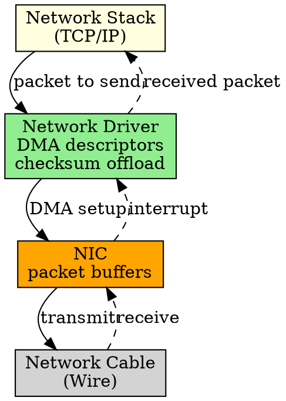

## The Problem

Network devices transfer data in packets (variable-sized frames) and must handle addressing (MAC), protocol headers, and often checksum offloading. Standard block/character drivers don't fit.

## Core Idea

A network driver manages network interface cards (NICs), handling packet send/receive, DMA for packet buffers, and often hardware acceleration (checksum, TSO).

## How It Works

1. OS passes packet (with headers) to driver for transmission
2. Driver sets up DMA descriptor for packet buffer
3. NIC DMAs packet from memory, adds PHY header, transmits
4. On receive, NIC DMAs packet to memory, raises interrupt
5. Driver passes packet up to network stack

## Key Properties

- Packet-based (variable size, unlike fixed blocks)
- Often uses DMA rings (multiple packet buffers queued)
- Hardware acceleration: checksum offload, TSO, RSS
- Examples: Ethernet driver, Wi-Fi driver, InfiniBand driver

## Connections

- **Built from:** [[device-driver|Device Driver]], [[io-devices|I/O Devices]]
- **Builds into:** [[system-bus|System Bus]] (connects to network)
- **Related:** [[dma|DMA]], [[interrupt-handler|Interrupt Handler]]
- **Contrasts with:** [[block-driver|Block Driver]] (packets vs blocks)

## Edge Cases & Gotchas

- Packet drop under high load (driver must handle ring exhaustion)
- DMA mapping must handle scattered packet buffers (SG DMA)
- Some NICs have buggy offload features — may need disabling

## Sources

- [[io-summary|I/O System Source Summary]]
