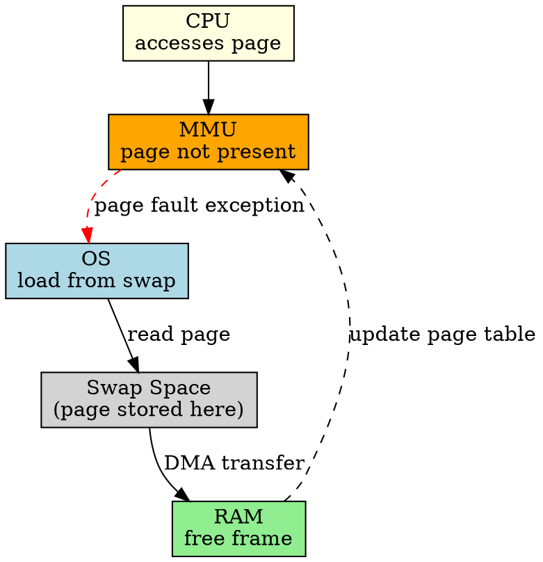

## The Problem

In paged virtual memory, a process may reference a page that isn't currently in RAM. The CPU needs to know this page isn't present so the OS can fetch it from disk.

## Core Idea

A page fault occurs when a program accesses a page not loaded in RAM, triggering the OS to fetch the page from disk (swap space) into a free frame.

## How It Works

1. CPU accesses a virtual address
2. MMU looks up page table, finds page not present (valid bit = 0)
3. CPU raises a page fault exception
4. OS checks if access is legal, finds free frame
5. OS schedules disk read to load page from swap
6. Page loaded, update page table, restart instruction

## Key Properties

- Minor page fault: page is in memory but not in process's page table
- Major page fault: page must be loaded from disk (slow!)
- Too many page faults = thrashing (system slow)
- Handled by OS, transparent to process

## Connections

- **Built from:** [[paging|Paging]], [[page-table|Page Table]]
- **Builds into:** [[demand-paging|Demand Paging]], [[thrashing|Thrashing]]
- **Related:** [[swap-space|Swap Space]], [[virtual-memory|Virtual Memory]]
- **Contrasts with:** [[segmentation|Segmentation]] (different memory model)

## Edge Cases & Gotchas

- Invalid access (segfault) raises SIGSEGV, not page fault
- Copy-on-write: page fault used to duplicate pages
- Page fault handling is expensive (disk I/O)

## Sources

- [[io-summary|I/O System Source Summary]]
