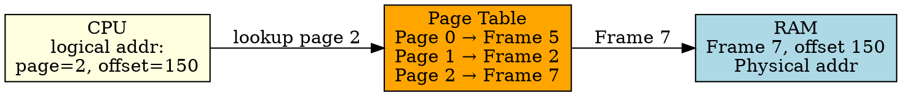

## The Problem

In paging, processes use virtual (logical) addresses, but RAM uses physical addresses. The CPU needs to know which physical frame corresponds to each virtual page.

## Core Idea

A page table is a data structure maintained by the OS that maps each virtual page of a process to its physical frame in RAM.

## How It Works

1. CPU generates logical address: page number + page offset
2. Page number is used as index into page table
3. Page table entry gives frame number
4. Physical address = frame number × page size + offset

## Key Properties

- One page table per process
- Stored in RAM (not in CPU registers — too large)
- Accessed on every memory reference (needs caching → TLB)
- Can be single-level, multi-level, or inverted

## Connections

- **Built from:** [[wiki/io/paging|Paging]], [[virtual-memory|Virtual Memory]]
- **Builds into:** [[tlb|TLB]], [[demand-paging|Demand Paging]]
- **Related:** [[multi-level-page-table|Multi-Level Page Table]], [[inverted-page-table|Inverted Page Table]]
- **Contrasts with:** [[segment-table|Segment Table]] (variable sizes vs fixed pages)

## Edge Cases & Gotchas

- Single-level page table can be huge (1M entries for 4GB process with 4KB pages)
- Multi-level page tables add levels of indirection
- Page table walks are slow (4 memory accesses for 4-level paging)