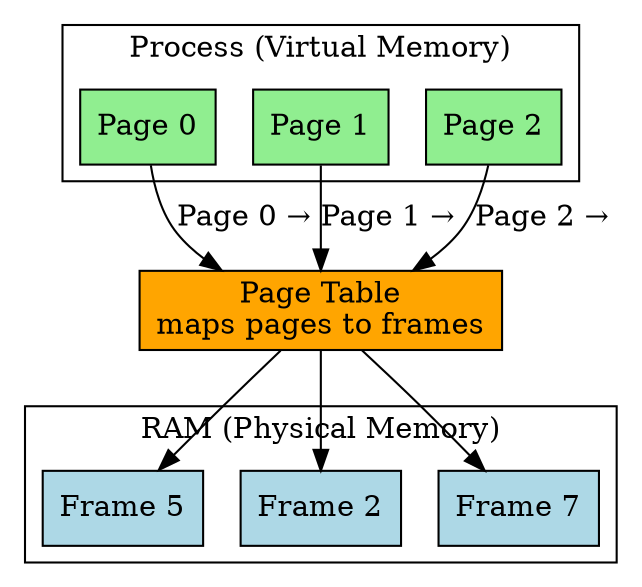

## The Problem

Contiguous memory allocation requires a process to be loaded in one continuous block of RAM, causing external fragmentation (wasted gaps between processes). We need non-contiguous allocation.

## Core Idea

Paging divides processes into fixed-size pages and RAM into page frames, allowing non-contiguous allocation and eliminating external fragmentation.

## How It Works

1. Process is divided into **pages** (e.g., 4KB each)
2. RAM is divided into **page frames** of same size
3. **Page table** maps each page to a frame in RAM
4. CPU generates logical address = page number + offset
5. MMU uses page table to translate to physical address = frame number + offset

## Key Properties

- Eliminates external fragmentation (pages can be anywhere)
- Fixed-size pages simplify allocation
- Page table overhead per process
- Internal fragmentation within pages (last page may not be full)

## Connections

- **Built from:** [[virtual-memory|Virtual Memory]], [[page-table|Page Table]]
- **Builds into:** [[page-fault|Page Fault]], [[demand-paging|Demand Paging]]
- **Related:** [[segmentation|Segmentation]], [[tlb|TLB]]
- **Contrasts with:** [[segmentation|Segmentation]] (fixed vs variable size)

## Edge Cases & Gotchas

- Internal fragmentation: last page partially filled wastes space
- Page table size grows with process size (use multi-level page tables)
- Every memory access needs page table lookup (slow → use TLB)

## Sources

- [[io-summary|I/O System Source Summary]]
