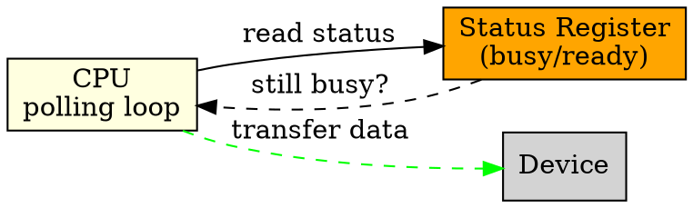

## The Problem

Interrupts require hardware support and can be complex to handle. For simple systems or when a quick response is needed, there must be a simpler way for the CPU to check if a device is ready.

## Core Idea

A technique where the CPU repeatedly checks (polls) a device's status register in a loop until the device is ready or operation completes, instead of using interrupts.

## How It Works

1. CPU writes command to device controller registers
2. CPU enters a loop: read status register repeatedly
3. If status indicates "busy" or "not ready", keep looping
4. When status changes to "ready" or "complete", proceed
5. Read/write data as needed

## Key Properties

- Simple to implement, no interrupt hardware needed
- CPU is fully occupied during polling (can't do other work)
- Gives predictable timing for real-time systems
- Wasteful for slow devices (CPU spins doing nothing)

## Connections

- **Built from:** [[io-system|I/O System]], [[device-controller|Device Controller]]
- **Builds into:** [[interrupt-handler|Interrupt Handler]] (alternative to polling)
- **Related:** [[dma|DMA]], [[io-request-to-hardware|I/O Request to Hardware Operation]]
- **Contrasts with:** [[interrupt-handler|Interrupt Handler]] (event-driven vs poll-driven)

## Edge Cases & Gotchas

- Can waste enormous CPU cycles for slow devices
- May miss events if polling interval is too long
- Useful for small embedded systems without interrupt controllers
- High throughput for bulk transfers (once polled, transfer quickly)