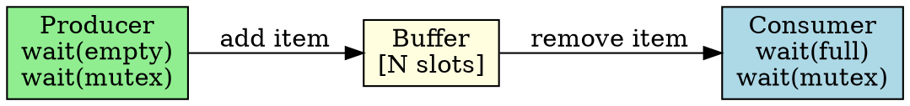

## The Problem

A producer generates data and puts it into a buffer, while a consumer takes data from the buffer. The buffer has limited size — producer must wait if full, consumer must wait if empty.

## Core Idea

A classic synchronization problem solved using three semaphores: empty (counts free slots), full (counts filled slots), and mutex (protects buffer access).

## How It Works

1. Producer waits on `empty` semaphore (decrements)
2. Producer waits on `mutex` (enters critical section)
3. Producer adds item to buffer
4. Producer signals `mutex` (exits critical section)
5. Producer signals `full` (increments)
6. Consumer does the reverse

## Key Properties

- Uses 3 semaphores: empty (N), full (0), mutex (1)
- Producer waits on empty, signals full
- Consumer waits on full, signals empty
- Mutex protects buffer data structure

## Connections

- **Built from:** [[semaphore|Semaphore]], [[counting-semaphore|Counting Semaphore]]
- **Builds into:** [[reader-writer|Reader-Writer Problem]]
- **Related:** [[wait-operation|Wait Operation]], [[signal-operation|Signal Operation]]
- **Contrasts with:** [[reader-writer|Reader-Writer]] (producer-consumer vs readers-writers)

## Edge Cases & Gotchas

- Wrong semaphore order can cause deadlock (always mutex last in, first out)
- Buffer must be protected by mutex during access
- Can be extended to multiple producers/consumers

## Sources

- [[io-summary|I/O System Source Summary]]
