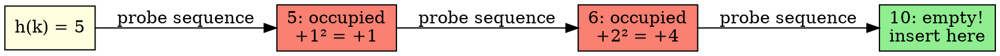

## The Problem

Linear probing causes primary clustering (long runs of occupied slots). We need a probing sequence that skips more slots each time to reduce clustering.

## Core Idea

Quadratic probing uses a quadratic function (i²) to determine probe sequence: h(k), h(k)+1², h(k)+2², h(k)+3², ...

## How It Works

1. Hash key to get initial index
2. If collision, check index + 1²
3. If still occupied, check index + 2²
4. Continue: index + 3², index + 4², ...
5. Wrap around table as needed

## Key Properties

- Reduces primary clustering compared to linear probing
- May not probe all slots (depends on table size)
- Works best when table size is prime number
- Load factor should be < 0.7 for good performance

## Connections

- **Built from:** [[hashing|Hashing]], [[collision-resolution|Collision Resolution]]
- **Builds into:** [[double-hashing|Double Hashing]]
- **Related:** [[linear-probing|Linear Probing]]
- **Contrasts with:** [[linear-probing|Linear Probing]] (quadratic vs linear skip)

## Edge Cases & Gotchas

- May not probe all table slots (unlike linear probing)
- Table size should be prime for best coverage
- Secondary clustering: same initial hash = same probe sequence