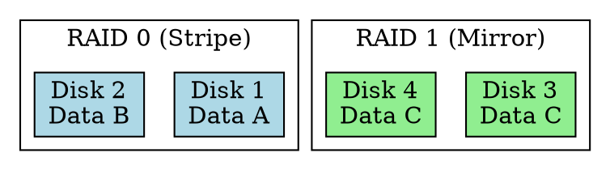

## The Problem

Disks fail — and when they do, data is lost. Single disks also have performance limits. We need techniques to combine multiple disks for reliability and/or speed.

## Core Idea

RAID combines multiple physical disks into a logical unit to provide redundancy (data safety) and/or improved performance.

## How It Works

RAID levels:

1. **RAID 0 (Striping)**: Data split across disks, no redundancy, fast but risky
2. **RAID 1 (Mirroring)**: Data duplicated to 2+ disks, full redundancy
3. **RAID 5 (Striping + Parity)**: Data + parity distributed, 1 disk failure tolerance
4. **RAID 6 (Striping + Double Parity)**: Tolerates 2 disk failures
5. **RAID 10 (1+0)**: Mirror pairs striped, best of both worlds

## Key Properties

- RAID 0: Performance ↑, Reliability ↓ (no redundancy)
- RAID 1: Reliability ↑, Cost ↑ (100% overhead)
- RAID 5: Balanced (1 disk overhead for parity)
- RAID 6: More reliable than 5 (2 disk failures)
- RAID 10: Best performance + reliability, but expensive

## Connections

- **Built from:** [[disk-management|Disk Management]], [[disk-structure|Disk Structure]]
- **Builds into:** [[disk-reliability|Disk Reliability]]
- **Related:** [[parity|Parity]], [[striping|Striping]], [[mirroring|Mirroring]]
- **Contrasts with:** [[swap-space|Swap Space]] (different purpose — performance vs capacity extension)

## Edge Cases & Gotchas

- RAID is not backup — accidental deletion still propagates
- RAID rebuild after failure is I/O intensive (risky if another disk fails)
- Software RAID vs Hardware RAID (hardware has battery-backed cache)