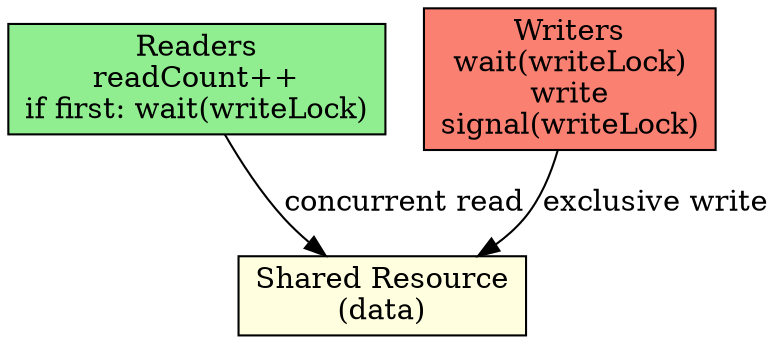

## The Problem

Multiple processes want to read or write a shared resource. Readers can access concurrently, but writers need exclusive access. We need to coordinate them.

## Core Idea

A synchronization problem where multiple readers can read simultaneously, but a writer requires exclusive access (no readers or other writers).

## How It Works

1. **Readers**: increment readCount (atomically), if first reader, wait on writeLock
2. **Readers**: read data, decrement readCount, if last reader, signal writeLock
3. **Writers**: wait on writeLock (exclusive access), write, signal writeLock
4. **Mutex**: protects readCount variable

## Key Properties

- Readers can proceed concurrently
- Writers need exclusive access
- Starvation possible: writers may starve if readers keep coming
- Uses readCount, mutex, writeLock semaphores

## Connections

- **Built from:** [[semaphore|Semaphore]], [[producer-consumer|Producer-Consumer Problem]]
- **Builds into:** [[race-condition|Race Condition]]
- **Related:** [[mutex|Mutex]], [[wait-operation|Wait Operation]]
- **Contrasts with:** [[producer-consumer|Producer-Consumer]] (readers concurrent vs producer-consumer serialized)

## Edge Cases & Gotchas

- Writer starvation: readers keep arriving, writer never gets access
- Reader starvation: writer locks resource, new readers blocked
- readCount must be protected by mutex (it's a shared variable)

## Sources

- [[io-summary|I/O System Source Summary]]
