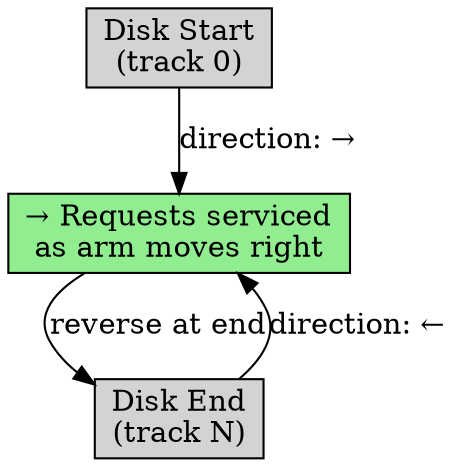

## The Problem

SSTF can starve requests at the edges of the disk. We need a fair algorithm that still performs well.

## Core Idea

SCAN (Elevator Algorithm) moves the disk arm in one direction, servicing requests along the way, then reverses direction at the end and repeats.

## How It Works

1. Disk arm starts moving in one direction (e.g., outward)
2. Service all requests in the current direction
3. When reaching the end, reverse direction
4. Service requests in the new direction
5. Continue like an elevator

## Key Properties

- No starvation (all requests eventually serviced)
- More uniform wait times than SSTF
- Can waste time going to disk end (even if no requests there)
- Like an elevator serving floors

## Connections

- **Built from:** [[disk-scheduling|Disk Scheduling]], [[sstf|SSTF]]
- **Builds into:** [[c-scan|C-SCAN]], [[look-scheduling|LOOK]]
- **Related:** [[disk-structure|Disk Structure]]
- **Contrasts with:** [[sstf|SSTF]] (no starvation vs possible starvation)

## Edge Cases & Gotchas

- High response time for requests at the edges (must wait for full sweep)
- May go to disk end unnecessarily (solved by LOOK)
- Better for heavy load than SSTF

## Sources

- [[io-summary|I/O System Source Summary]]
