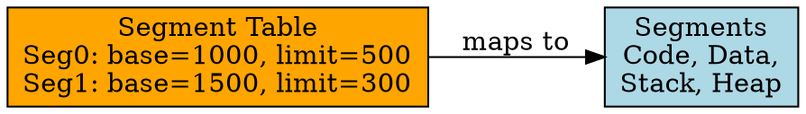

## The Problem

Paging uses fixed-size pages, which don't match program structure (code, data, stack are different logical units). We need variable-size chunks that match program semantics.

## Core Idea

Segmentation divides memory into variable-size logical units (segments) like code, data, stack, each with a segment table mapping to physical memory.

## How It Works

1. Program divided into segments (code, data, stack, heap)
2. Each segment has: base address, limit (size)
3. Segment table maps segment number → (base, limit)
4. Address = segment number + offset within segment
5. Hardware checks offset < limit (protection)

## Key Properties

- Variable-size segments (no internal fragmentation)
- Matches program structure (logical units)
- External fragmentation (gaps between segments)
- Easier sharing (share entire segment)

## Connections

- **Built from:** [[virtual-memory|Virtual Memory]], [[wiki/io/paging|Paging]]
- **Builds into:** [[paging-vs-segmentation|Paging vs Segmentation]]
- **Related:** [[segment-table|Segment Table]], [[external-fragmentation|External Fragmentation]]
- **Contrasts with:** [[wiki/io/paging|Paging]] (variable vs fixed size)

## Edge Cases & Gotchas

- External fragmentation: gaps between segments
- Segment table overhead per process
- Segment bounds checking required (hardware)

## Sources

- [[io-summary|I/O System Source Summary]]
