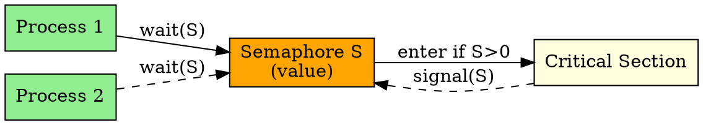

## The Problem

Multiple processes/threads access shared resources concurrently, leading to race conditions (incorrect results when operations interleave). We need a synchronization mechanism to coordinate access.

## Core Idea

A semaphore is an integer variable with two atomic operations (wait/signal) used to control access to shared resources and prevent race conditions.

## How It Works

1. Semaphore has integer value (initialized to N = number of available resources)
2. **wait()** (P operation): Decrement semaphore; if negative, block the process
3. **signal()** (V operation): Increment semaphore; if was negative, wake up a blocked process
4. Operations are atomic (cannot be interrupted mid-execution)

## Key Properties

- Atomic operations (wait/signal) prevent race conditions
- Can be binary (0/1) for mutual exclusion
- Can be counting (0..N) for resource pools
- Used to solve producer-consumer, reader-writer problems

## Connections

- **Built from:** [[race-condition|Race Condition]], [[critical-section|Critical Section]]
- **Builds into:** [[binary-semaphore|Binary Semaphore]], [[counting-semaphore|Counting Semaphore]]
- **Related:** [[producer-consumer|Producer-Consumer Problem]], [[reader-writer|Reader-Writer Problem]]
- **Contrasts with:** [[mutex|Mutex]] (binary semaphore = mutex, but semaphore can be >1)

## Edge Cases & Gotchas

- Busy waiting in some implementations wastes CPU
- Deadlock if processes wait for each other circularly
- Priority inversion: high-priority process blocked by lower-priority holder

## Sources

- [[io-summary|I/O System Source Summary]]
