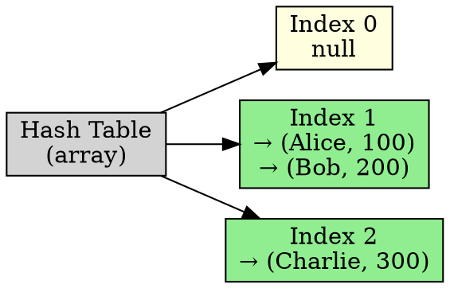

## The Problem

When two keys hash to the same index, we need to store both. Arrays only hold one value per slot.

## Core Idea

Each slot in the hash table holds a linked list (chain) of all key-value pairs that hashed to that index.

## How It Works

1. Hash function computes index for a key
2. Key-value pair is appended to the linked list at that index
3. To search: hash to index, then linearly search the chain
4. To delete: find in chain and remove node

## Key Properties

- Simple to implement
- Handles high load factors better than probing
- Each chain should be short (ideally O(1) length)
- Deletion is straightforward (just remove from linked list)

## Connections

- **Built from:** [[hashing|Hashing]], [[collision-resolution|Collision Resolution]]
- **Builds into:** [[load-factor|Load Factor]]
- **Related:** [[linked-list|Linked List]], [[hash-function|Hash Function]]
- **Contrasts with:** [[linear-probing|Linear Probing]] (chains vs probing)

## Edge Cases & Gotchas

- Long chains → degrades to O(n) search time
- Extra memory for linked list pointers
- Poor hash function → all keys in one chain
- Best when hash function distributes uniformly