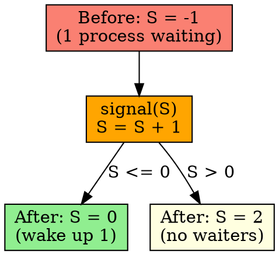
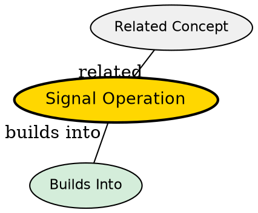

## The Problem

When a process finishes using a resource, it needs to release it and wake up any waiting processes. We need an atomic operation that increments the semaphore.

## Core Idea

The signal() operation (V operation) increments the semaphore value atomically. If there are waiting processes (S ≤ 0), one is woken up.

## How It Works

1. Atomically increment semaphore value: S = S + 1
2. If S ≤ 0 after increment: a process was waiting, wake it up
3. If S > 0 after increment: no one was waiting
4. Woken process can now acquire the resource

## Key Properties

- Must be atomic (no interruption)
- Wakes up at most one waiting process
- Releases resource back to pool
- Also called V (verhogen = to release) or up operation

## Semantic Network

## Connections

- **Built from:** [[semaphore|Semaphore]]
- **Builds into:** [[binary-semaphore|Binary Semaphore]], [[counting-semaphore|Counting Semaphore]]
- **Related:** [[wait-operation|Wait Operation]], [[critical-section|Critical Section]]
- **Contrasts with:** [[wait-operation|Wait Operation]] (increment vs decrement)

## Edge Cases & Gotchas

- Calling signal() without holding resource is a bug
- Must be atomic -- can't be interrupted
- Forgetting signal() causes deadlock (resource never released)