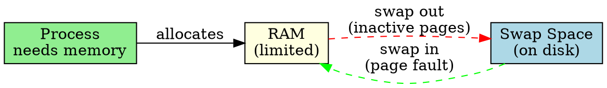

## The Problem

RAM is limited and expensive. When all RAM is full, the OS needs somewhere to put inactive processes so active ones can continue running.

## Core Idea

Swap space is a portion of the disk used as an extension of RAM — inactive pages are moved (swapped) from RAM to disk to free memory.

## How It Works

1. RAM becomes full → OS selects inactive pages
2. Pages are written to swap space on disk
3. If swapped-out page is needed again, OS reads it back (page fault)
4. Process continues as if nothing happened (transparent to process)

## Key Properties

- Acts as overflow for RAM (allows more processes than physical RAM)
- Much slower than RAM (disk access is ~100,000x slower)
- Can be dedicated partition or swap file in file system
- Excessive swapping = "thrashing" (system becomes very slow)

## Connections

- **Built from:** [[disk-management|Disk Management]], [[wiki/io/paging|Paging]]
- **Builds into:** [[virtual-memory|Virtual Memory]]
- **Related:** [[page-fault|Page Fault]], [[wiki/io/thrashing|Thrashing]]
- **Contrasts with:** [[ram|RAM]] (fast but limited vs slow but large)

## Edge Cases & Gotchas

- Swap on SSD wears out flash cells (limited write endurance)
- Too much swapping = thrashing (spending all time swapping, not working)
- Some systems allow disabling swap (risky — OOM killer may activate)