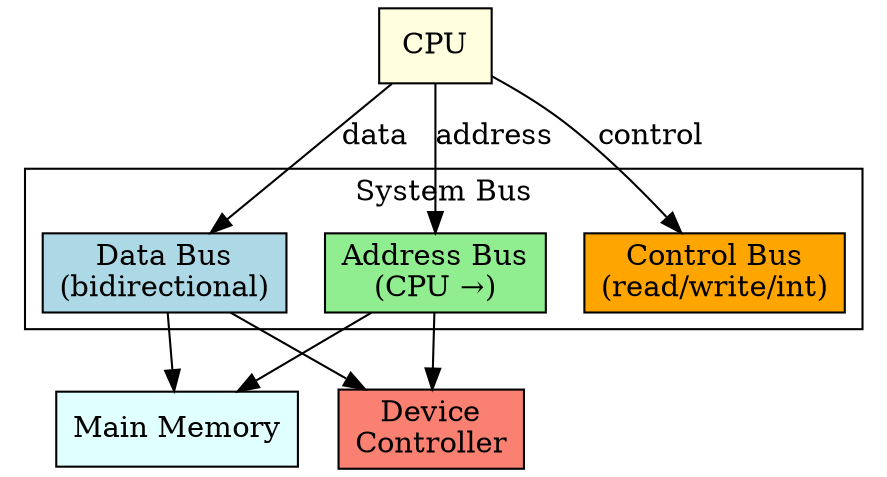

## The Problem

CPU, memory, and I/O controllers need to communicate — transferring data, addresses, and control signals. Individual wires between every pair would be impossible. A shared communication pathway is needed.

## Core Idea

The system bus is the shared communication pathway connecting CPU, memory, and I/O controllers, consisting of three parts: data bus, address bus, and control bus.

## How It Works

The system bus has three components:

1. **Data Bus**: Carries actual data between devices (bidirectional)
2. **Address Bus**: Carries memory/device addresses (unidirectional from CPU)
3. **Control Bus**: Carries control signals (read, write, interrupt, clock)

## Key Properties

- Shared by all components (requires bus arbitration)
- Width (bits) determines performance (64-bit bus = 8 bytes/transfer)
- Clock speed limits transfer rate
- Modern systems may have multiple buses (PCIe, memory bus, etc.)

## Connections

- **Built from:** [[io-system|I/O System]], [[cpu|CPU]], [[device-controller|Device Controller]]
- **Builds into:** [[dma|DMA]], [[io-request-to-hardware|I/O Request to Hardware Operation]]
- **Related:** [[device-controller|Device Controller]], [[memory|Main Memory]]
- **Contrasts with:** [[io-software-structure|I/O Software Structure]] (hardware vs software)

## Edge Cases & Gotchas

- Bus contention: multiple devices wanting the bus simultaneously
- Bus mastering: devices (like DMA) can become bus masters
- Modern systems have switched fabrics (PCIe) instead of shared buses