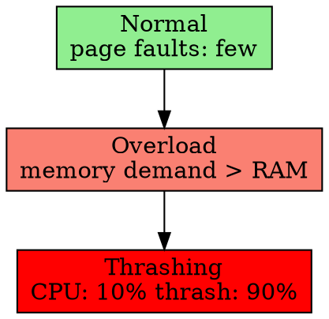

## The Problem

When the system is overcommitted (more process demand than RAM), it spends more time swapping pages in/out than doing useful work.

## Core Idea

Thrashing is a state where the OS spends most of its time handling page faults and swapping, leaving little CPU time for actual process execution.

## How It Works

1. System runs many processes, total memory demand > RAM
2. Page fault rate increases dramatically
3. OS responds by swapping pages out to disk
4. Pages immediately needed again → more page faults
5. CPU utilization drops (most time spent in page fault handling)

## Key Properties

- Caused by overcommitment (too many active processes)
- CPU utilization drops to near zero
- System becomes unresponsive
- Fix: reduce degree of multiprogramming (fewer processes)

## Connections

- **Built from:** [[virtual-memory|Virtual Memory]], [[swap-space|Swap Space]]
- **Builds into:** [[demand-paging|Demand Paging]]
- **Related:** [[page-fault|Page Fault]], [[wiki/io/paging|Paging]]
- **Contrasts with:** [[normal-execution|Normal Execution]] (working vs thrashing)

## Edge Cases & Gotchas

- Can cascade: thrashing in one process causes others to thrash too
- Monitor page fault rate to detect early
- Fix: suspend/kill processes, or add more RAM

## Sources

- [[io-summary|I/O System Source Summary]]
