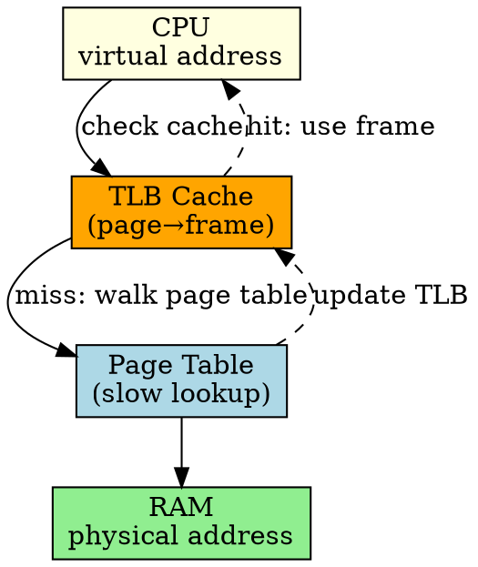

## The Problem

Every memory access in a paged system requires a page table lookup (extra memory access), making every reference 2x slower. We need to cache recent translations.

## Core Idea

TLB is a hardware cache that stores recent virtual-to-physical page translations, making address translation O(1) in the common case.

## How It Works

1. CPU generates virtual address
2. TLB checked first (parallel lookup, very fast)
3. If TLB hit: use cached frame number directly
4. If TLB miss: do page table walk, update TLB
5. Access memory with physical address

## Key Properties

- Hit rate typically >95% for well-behaved programs
- Hardware-managed (some architectures) or software-managed (MIPS)
- TLB flush on context switch (different process = different pages)
- Small but very fast (32-1024 entries typical)

## Connections

- **Built from:** [[paging|Paging]], [[page-table|Page Table]]
- **Builds into:** [[virtual-memory|Virtual Memory]]
- **Related:** [[cache|CPU Cache]], [[address-translation|Address Translation]]
- **Contrasts with:** [[page-table|Page Table]] (cache vs backing store)

## Edge Cases & Gotchas

- TLB flush on context switch hurts performance
- Some entries can be wired (never flushed, for kernel)
- TLB miss handling is in hardware or software depending on architecture

## Sources

- [[io-summary|I/O System Source Summary]]
