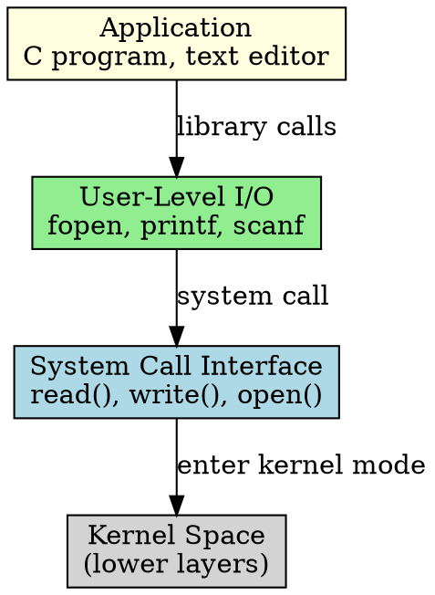

## The Problem

Applications need to perform I/O (read files, write data, print) but shouldn't talk directly to hardware — that would require every program to know every device's details.

## Core Idea

The topmost layer of I/O software that provides system calls and library functions (`read()`, `write()`, `fopen()`) for applications to request I/O operations.

## How It Works

1. Application calls I/O functions (`fopen("file.txt", "r")`)
2. These functions invoke system calls that switch to kernel mode
3. Library handles formatting (printf/scanf), buffering in user space
4. Spooling for devices like printers is managed at this layer
5. Request is passed down to device-independent I/O software

## Key Properties

- Runs in user space (unprivileged mode)
- Provides familiar APIs (stdio.h in C)
- Handles user-space buffering and formatting
- Spooling for shared devices (printers) happens here

## Connections

- **Built from:** [[io-software-structure|I/O Software Structure]], [[system-call|System Call]]
- **Builds into:** [[io-request-to-hardware|I/O Request to Hardware Operation]]
- **Related:** [[io-system|I/O System]], [[device-independent-io-software|Device-Independent I/O Software]]
- **Contrasts with:** [[device-driver|Device Driver]] (kernel space, hardware-specific)

## Edge Cases & Gotchas

- User-space buffering can delay writes (must flush explicitly)
- System call overhead for each I/O operation (mitigated by buffering)
- Library functions may mask errors — always check return values

## Sources

- [[io-summary|I/O System Source Summary]]
