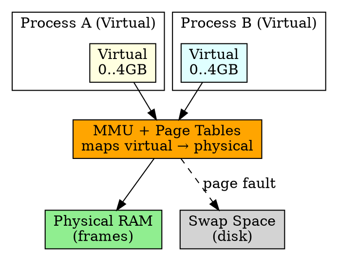

## The Problem

Programs need more memory than physically available, and we want isolation between processes (one process shouldn't access another's memory). Physical RAM alone can't provide this.

## Core Idea

Virtual memory gives each process the illusion of a large, contiguous address space, mapped to physical RAM via paging, with unused pages stored on disk (swap).

## How It Works

1. Each process has its own virtual address space (e.g., 4GB on 32-bit)
2. Virtual pages mapped to physical frames via page table
3. Pages not in RAM are stored in swap space on disk
4. Access to swapped-out page causes page fault → OS loads it
5. Processes isolated (can't access other process's pages)

## Key Properties

- Isolation: each process has separate address space
- Overcommit: can allocate more virtual memory than physical RAM
- Demand paging: pages loaded only when accessed
- Enables swap space to extend RAM

## Connections

- **Built from:** [[paging|Paging]], [[demand-paging|Demand Paging]]
- **Builds into:** [[swap-space|Swap Space]], [[thrashing|Thrashing]]
- **Related:** [[tlb|TLB]], [[page-table|Page Table]]
- **Contrasts with:** [[physical-memory|Physical Memory]] (virtual vs real)

## Edge Cases & Gotchas

- Thrashing: too much swapping, system becomes very slow
- OOM killer: Linux kills processes when memory exhausted
- Swap on SSD wears out flash cells

## Sources

- [[io-summary|I/O System Source Summary]]
