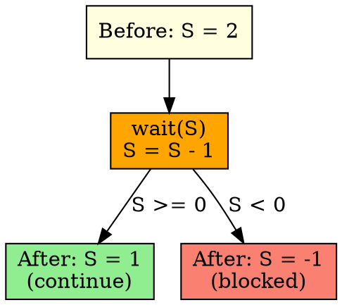

## The Problem

Processes need to acquire a resource or enter a critical section atomically, without race conditions. We need an operation that decrements the semaphore and blocks if the resource isn't available.

## Core Idea

The wait() operation (P operation) decrements the semaphore value atomically. If the result is negative, the process blocks and waits.

## How It Works

1. Atomically decrement semaphore value: S = S - 1
2. If S ≥ 0 after decrement: process continues (acquired resource)
3. If S < 0 after decrement: process blocks and is added to wait queue
4. Process sleeps until another process calls signal()

## Key Properties

- Must be atomic (no interruption during execution)
- Can cause blocking (process sleeps)
- Implemented in kernel (for system semaphores)
- Also called P (prolagen = to test) or down operation

## Connections

- **Built from:** [[semaphore|Semaphore]]
- **Builds into:** [[binary-semaphore|Binary Semaphore]], [[counting-semaphore|Counting Semaphore]]
- **Related:** [[signal-operation|Signal Operation]], [[critical-section|Critical Section]]
- **Contrasts with:** [[signal-operation|Signal Operation]] (decrement vs increment)

## Edge Cases & Gotchas

- Busy-waiting implementation wastes CPU (better to sleep)
- Must be atomic — can't be interrupted mid-execution
- Forgetting to call wait() causes race conditions

## Sources

- [[io-summary|I/O System Source Summary]]
