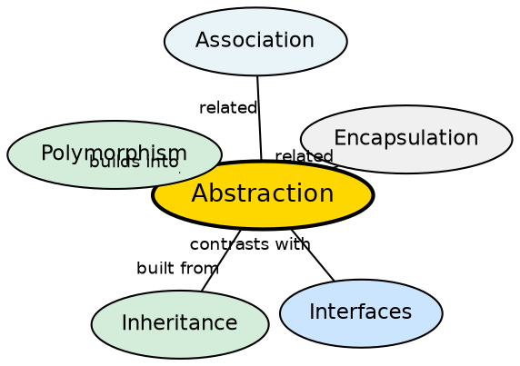

## The Problem

When designing class hierarchies, some behaviors should be defined at a general level without specifying implementation details. Without abstraction, every base class must provide complete implementations for all methods, even when the implementation is unknown or varies dramatically across subclasses. Users are forced to understand complex internals to use simple functionality — like needing to know how an ATM's cash dispenser mechanics work just to withdraw money.

## Core Idea

**Abstraction** hides implementation details and exposes only essential features. It helps users focus on **what** an object does rather than **how** it does it. In Java, abstraction is achieved through **abstract classes** (partial abstraction — can have state and concrete methods) and **interfaces** (full abstraction — pure contracts before Java 8).

## How It Works

An abstract class is declared with the `abstract` keyword. It may contain both abstract methods (no body) and concrete methods. Subclasses use `extends` and must implement all abstract methods (or be declared abstract themselves). Interfaces use `implements` and provide 100% abstraction — they define only method signatures (pre-Java 8). The key distinction: abstract classes can hold state and constructors; interfaces cannot.

## Visual Explanation

```dot
digraph java_abstraction {
  rankdir=TB
  node [shape=box style=filled fillcolor="#f0f4ff" fontname="Helvetica" fontsize=12]
  edge [fontname="Helvetica" fontsize=10]

  Subgraph [label="Users see only:" fillcolor="#e8f4f8"]
  ATM [label="ATM Interface\ninsertCard()\nenterPIN()\nwithdraw()" fillcolor="#ffe5cc"]
  Impl [label="Hidden Internals:\n- Bill dispenser logic\n- Account validation\n- Network calls\n- Receipt printing" fillcolor="#d4edda"]

  User [label="Bank Customer"]
  ATM_Iface [label="Abstract Class: Account\ngetter: getBalance()\nabstract: void withdraw()" fillcolor="#ffe5cc"]
  AbsClass [label="Abstract Class: Shape\nfield: color\nconcrete: move()\nabstract: draw()" fillcolor="#fff3cd"]
  Interface [label="Interface: Drawable\ndraw()\n(100% abstract)" fillcolor="#cce5ff"]

  User -> ATM [label="uses"]
  ATM -> Impl [label="hides"]
  Interface -> AbsClass [label="contrasts"]
}
```

## Semantic Network



## Key Properties

- **Cannot instantiate**: `new Animal()` is illegal for abstract classes and interfaces
- **Abstract methods**: Must be overridden in the first concrete subclass
- **Can have constructors**: Abstract classes can have constructors called via `super()`; interfaces cannot
- **Partial vs Full**: Abstract classes provide partial abstraction; interfaces provide 100% abstraction
- **Hides complexity**: Users interact with simple operations while internals remain hidden

## Connections

- **Built from:** [[java-inheritance|Java Inheritance]] — abstract classes use the extends mechanism
- **Builds into:** [[java-polymorphism|Java Polymorphism]] — abstract methods enable polymorphic behavior
- **Contrasts with:** [[java-interfaces|Java Interfaces]] — interfaces are fully abstract (pre-Java 8); abstract classes can have state
- **Related:** [[java-encapsulation|Java Encapsulation]] — both are OOP pillars working together
- **Related:** [[java-abstract-class-vs-interface|Abstract Class vs Interface]] — synthesis comparing the two mechanisms

## Edge Cases & Gotchas

- **Abstract class vs interface confusion**: Use abstract classes for "is-a" with shared state; interfaces for "can-do" with behavior contracts
- **Abstract methods in enums**: Enum types can have abstract methods per-constant
- **Cannot be final**: An abstract class cannot be declared `final` (contradictory — abstraction requires extension)
- **Performance**: Virtual method dispatch for abstract methods has minimal overhead (single vtable lookup)
- **Interfaces with default methods (Java 8+)**: Interfaces can now have default and static methods, blurring the line with abstract classes

## Sources

- [[java1-summary|Java Tutorial — Source Summary]] — abstraction, inheritance, interfaces
- [[java2-summary|Java OOP Concepts — Source Summary]] — expanded abstraction with real-world metaphors
