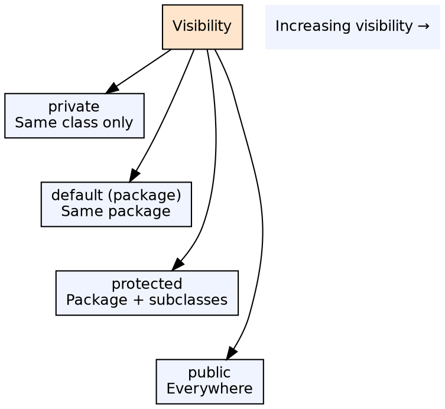
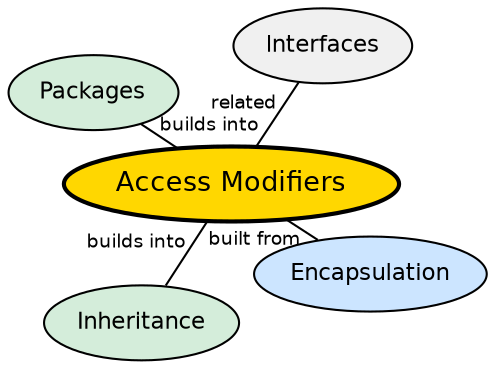

## The Problem

As programs grow, developers need fine-grained control over which parts of the code can access which members. Without access control, any class could read or modify any field of any other class, making encapsulation impossible and creating tight coupling that breaks with every change.

## Core Idea

Java provides four access levels: **private** (only within the class), **default/package-private** (within the package), **protected** (package + subclasses), and **public** (everywhere). These modifiers can be applied to classes, methods, and fields to enforce encapsulation boundaries.

## How It Works

The compiler checks access rules at compile time. If a method in class A tries to access a `private` field of class B, the compiler rejects it. Access modifiers do not affect runtime behavior — they are a compile-time enforcement mechanism. Protected access also grants access to subclasses in different packages.

## Visual Explanation

## Semantic Network

## Key Properties

- **Class-level access**: Only `public` and `default` (no `private` or `protected` for top-level classes)
- **Interface members**: Methods in interfaces are implicitly `public`
- **Constructors**: Can be private (singleton pattern), protecting instantiation
- **Override rules**: Cannot reduce visibility when overriding (child cannot be more restrictive than parent)

## Connections

- **Built from:** [[java-encapsulation|Java Encapsulation]] — access modifiers are the mechanism for data hiding
- **Builds into:** [[java-inheritance|Java Inheritance]] — override rules depend on access level of parent methods
- **Builds into:** [[java-packages|Java Packages]] — default access is tied to package boundaries
- **Related:** [[java-methods|Java Methods]] — every method has an access level

## Edge Cases & Gotchas

- **Protected means access from subclasses, not by subclasses**: You can access a protected member only through an expression of the subclass type, not the parent type
- **Reflection bypasses access modifiers**: `setAccessible(true)` breaks encapsulation at runtime
- **Default is not "friendly"**: Officially called package-private — no keyword; absence of modifier means default
- **Nested classes**: Private members of outer class are accessible to inner classes

## Sources

- [[java1-summary|Java Tutorial — Source Summary]] — access modifiers
