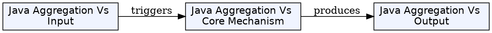
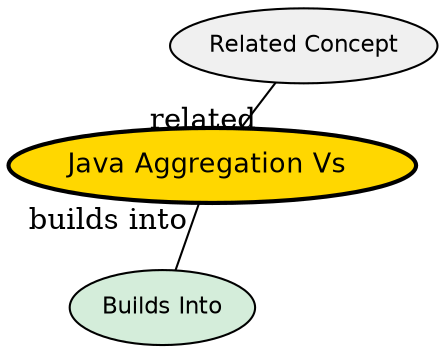

## What's Being Compared

Two forms of association in Java: **Aggregation** (weak "has-a") and **Composition** (strong "has-a"). Both represent whole-part relationships but differ fundamentally in lifecycle dependency and ownership semantics.

## The Core Tension

The key question is: **who owns the lifecycle?** In aggregation, parts can outlive the whole. In composition, the whole owns the parts completely -- when the whole dies, the parts die with it. Choosing wrong creates either memory leaks (too strong) or premature destruction (too weak).

## Comparison

| Dimension | [[java-aggregation|Aggregation]] | [[java-composition|Composition]] |
|-----------|--------------|---------------|
| Relationship strength | Weak | Strong |
| Lifecycle dependency | Independent | Dependent |
| Ownership | Shared (multiple containers can share) | Exclusive (one owner) |
| Object creation | Created externally, passed in | Created inside container constructor |
| UML notation | Hollow diamond | Filled diamond |
| Example | Company has Employees | House has Rooms |
| Part survival after container death | Survives | Dies with container |
| Memory implication | Part may remain reachable | Part becomes unreachable |
| Code pattern | `class Company { List<Employee> employees; }` | `class House { List<Room> rooms = new ArrayList<>(); }` |

## When to Choose Aggregation

- Parts have independent existence (Employees, Students, Customers)
- Parts are shared across multiple containers (a Student in multiple Courses)
- The container is a temporary grouping, not a parent

## When to Choose Composition

- Parts have no meaning outside the container (Rooms of a House, Pages of a Book)
- Exclusive ownership is required (a BankAccount's TransactionHistory)
- Lifecycle management should be automatic (create part with container, destroy with container)

## The Insight

The distinction is fundamentally about **lifecycle responsibility**. Aggregation transfers the lifecycle burden to external code (someone else must create and destroy the parts). Composition internalizes it (the container manages everything). This has real consequences: aggregation is more flexible but can cause memory leaks if parts aren't cleaned up; composition is safer but less reusable.

## Visual Explanation

## Semantic Network

## Connections

- [[java-aggregation|Aggregation]] -- weak association with independent lifecycles
- [[java-composition|Composition]] -- strong association with dependent lifecycles
- [[java-association|Association]] -- the parent concept of both
- [[java-encapsulation|Encapsulation]] -- both rely on encapsulation to manage internal state