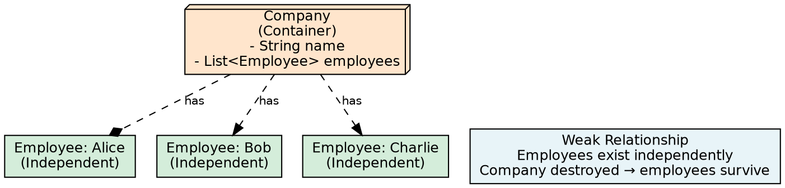
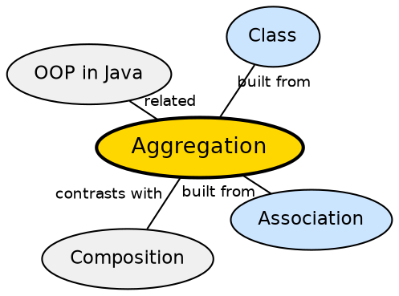

## The Problem

In some relationships, a class needs to contain or reference other objects, but the contained objects should remain independent — they have their own lifecycle and can exist without the container. For example, a Company has Employees, but employees continue to exist even after the company is dissolved.

## Core Idea

**Aggregation** represents a **"has-a" relationship** where one class contains a reference to another class, but both can exist independently. It is a weak form of association. The contained objects have independent lifecycles — they can exist with or without the container. Aggregation is often described as "Team has Players" where players exist even if the team disbands.

## How It Works

Aggregation is implemented as a field reference where the contained object is created externally and passed in (e.g., via constructor or setter). The container holds a reference but does not manage the lifecycle of the contained object. When the container is garbage collected, the contained object continues to exist if referenced elsewhere. In UML, aggregation is denoted by a hollow diamond on the container side.

## Visual Explanation

## Semantic Network

## Key Properties

- **Weak relationship**: The container does not own the contained objects
- **Independent lifecycles**: Contained objects exist independently of the container
- **Shared ownership**: A contained object can belong to multiple containers simultaneously
- **External creation**: Contained objects are typically created outside and passed in
- **UML notation**: Hollow diamond on the container side

## Connections

- **Built from:** [[java-association|Java Association]] — aggregation is a specialized form of association
- **Contrasts with:** [[java-composition|Java Composition]] — composition has dependent lifecycles; aggregation has independent lifecycles
- **Related:** [[java-aggregation-vs-composition|Aggregation vs Composition]] — synthesis comparing the two relationship types
- **Related:** [[java-encapsulation|Java Encapsulation]] — encapsulation ensures that aggregated objects are accessed through controlled interfaces

## Edge Cases & Gotchas

- **Aggregation vs Association in practice**: The distinction is subtle — aggregation implies a "whole-part" semantic; plain association does not
- **Null container**: If the container is destroyed, the aggregated objects may lose one reference but continue to exist via other references
- **Memory leaks**: Holding references to aggregated objects longer than needed can prevent garbage collection
- **Serialization complexity**: Aggregated objects may need special handling during serialization to avoid deep-copying independent objects

## Sources

- [[java2-summary|Java OOP Concepts — Source Summary]] — aggregation as weak has-a with Company/Employees example
