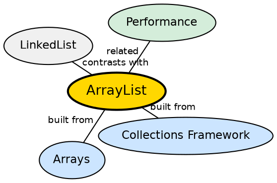

## The Problem

Arrays have a fixed size — once created, they cannot grow or shrink. For most applications, the number of elements is not known in advance. A data structure that can grow and shrink dynamically while providing array-like O(1) indexed access is essential.

## Core Idea

**ArrayList** is a resizable array implementation of the `List` interface. It maintains an internal `Object[]` array that grows automatically as elements are added. It provides O(1) get/set by index, amortized O(1) add, and O(n) insert/remove in the middle.

## How It Works

When created, ArrayList allocates an internal array of default size 10 (Java 8+). When the array is full and a new element is added, a new array of size `(oldCapacity * 3/2) + 1` is allocated, and all elements are copied to the new array. Removal at an arbitrary index shifts all subsequent elements left.

## Visual Explanation

```dot
digraph java_arraylist {
  rankdir=LR
  node [shape=box style=filled fillcolor="#f0f4ff" fontname="Helvetica" fontsize=12]
  edge [fontname="Helvetica" fontsize=10]

  AL [label="ArrayList<String>\nsize=3, capacity=10" fillcolor="#ffe5cc"]
  E0 [label='[0]: "A"']
  E1 [label='[1]: "B"']
  E2 [label='[2]: "C"']
  E3 [label="[3..9]: null"]
  Add [label='add("D") →\n[3] = "D"\nsize=4' fillcolor="#d4edda"]
  Grow [label="add() when full→\ngrow array\nold*1.5+1" fillcolor="#ffcccc"]

  AL -> E0
  AL -> E1
  AL -> E2
  AL -> E3
  AL -> Add
  AL -> Grow
}
```

## Semantic Network



## Key Properties

- **O(1) random access**: get(index) and set(index, value) are constant time
- **O(n) insert/delete**: Inserting or removing in the middle requires shifting elements
- **Capacity management**: Initial capacity can be specified; grows automatically
- **Fail-fast iterator**: Throws ConcurrentModificationException on concurrent modification

## Connections

- **Built from:** [[java-collections-framework|Java Collections Framework]] — ArrayList implements the List interface
- **Built from:** [[java-arrays|Java Arrays]] — ArrayList is backed by an Object[] array
- **Contrasts with:** [[java-collections-framework|Collections Framework]] — ArrayList is for random access; LinkedList is better for insert/delete at ends
- **Related:** [[java-hashmap|HashMap]] — both are the most commonly used collection implementations

## Edge Cases & Gotchas

- **Capacity not the same as size**: `size()` returns actual element count, not array capacity
- **SubList is a view**: `subList()` returns a view backed by the original list — modifying either affects both
- **trimToSize()**: Reduces capacity to current size to save memory
- **Not synchronized**: Use `Collections.synchronizedList()` or `CopyOnWriteArrayList` for thread safety