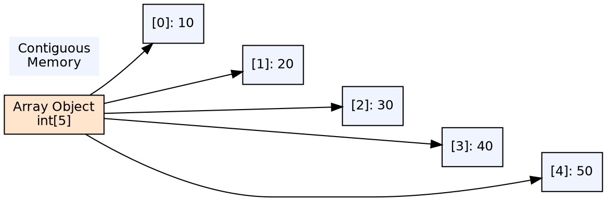
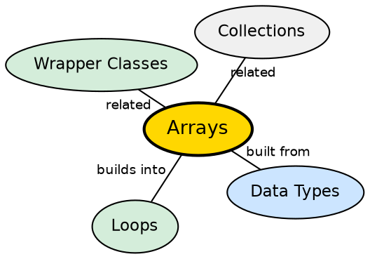

## The Problem

Storing and managing multiple values of the same type is a fundamental programming need. Without arrays, developers would need a separate variable for every data item — impractical for even a dozen values, impossible for thousands. Programs need a contiguous, indexable data structure for homogeneous collections.

## Core Idea

An **array** in Java is a container object that holds a fixed number of values of a single type. Arrays are indexed starting at 0, have a fixed length set at creation, and provide O(1) access to any element by index. Java supports single-dimensional arrays, multi-dimensional arrays (arrays of arrays), and jagged arrays (sub-arrays of different lengths).

## How It Works

Arrays are objects on the heap. When created, a contiguous block of memory is allocated: for primitives, the actual values; for objects, references. The length is stored in a header field. Access is bounds-checked at runtime — accessing index < 0 or ≥ length throws `ArrayIndexOutOfBoundsException`.

## Visual Explanation

## Semantic Network

## Key Properties

- **Fixed length**: Cannot grow or shrink after creation
- **Zero-indexed**: First element at index 0, last at length-1
- **.length**: Array length is accessed via the `length` field (not a method)
- **Multi-dimensional**: `int[][] matrix = new int[3][4]` — array of 3 arrays of 4 ints each

## Connections

- **Built from:** [[java-data-types|Java Data Types]] — arrays hold elements of a declared type
- **Built from:** [[java-loops|Java Loops]] — arrays are typically traversed with loops
- **Builds into:** [[java-collections-framework|Collections Framework]] — Java's collections provide dynamic alternatives to fixed-size arrays
- **Contrasts with:** [[java-arraylist|ArrayList]] — arrays are fixed-size, ArrayList is dynamic

## Edge Cases & Gotchas

- **Array covariance**: `String[]` is a subtype of `Object[]` — storing a non-String throws `ArrayStoreException` at runtime
- **Clone is shallow**: `array.clone()` on an object array copies references, not objects
- **Jagged arrays are arrays of arrays**: `int[][]` where each sub-array can have different lengths
- **Zero-length array is valid**: `new int[0]` is useful for returning empty results

## Sources

- [[java1-summary|Java Tutorial — Source Summary]] — arrays
