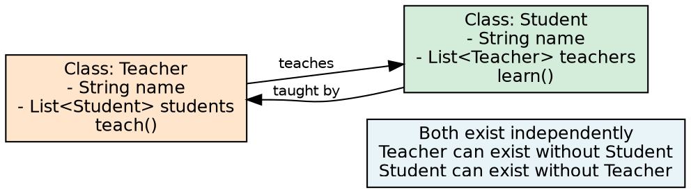
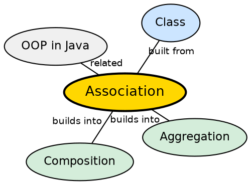

## The Problem

Objects in a system rarely exist in isolation — they need to interact, communicate, and reference each other to accomplish tasks. Without a formal way to define relationships between classes, the code would have no structure for how objects find and interact with each other, leading to tightly coupled spaghetti.

## Core Idea

**Association** is an OOP concept that defines a relationship between two or more classes that are connected to each other. It represents how objects interact with each other and communicate. In association, objects of one class are related to objects of another class, but they can exist independently. Association does not imply ownership — it simply means there is a structural or behavioral link between the classes.

## How It Works

Association is implemented as a field reference: one class holds a reference to another class. The referenced object is passed in (typically via constructor or method parameter) rather than created inside the class. Because the lifecycle is independent, either object can be garbage collected without affecting the other. Association is the most general form of relationship; aggregation and composition are specialized subtypes.

## Visual Explanation

## Semantic Network

## Key Properties

- **Bi-directional or uni-directional**: Both classes may know about each other, or only one may hold the reference
- **Independent lifecycles**: Objects can exist without each other
- **No ownership**: Neither class "owns" the other — it's a peer relationship
- **Most general form**: Association is the broadest type of class relationship
- **Multiplicity**: Can be one-to-one, one-to-many, many-to-many

## Connections

- **Builds into:** [[java-aggregation|Java Aggregation]] — a weaker form of association with "has-a" semantics
- **Builds into:** [[java-composition|Java Composition]] — a stronger form of association with ownership
- **Contrasts with:** [[java-inheritance|Java Inheritance]] — association is a "uses-a" relationship; inheritance is an "is-a" relationship
- **Related:** [[java-encapsulation|Java Encapsulation]] — well-encapsulated classes form clean associations

## Edge Cases & Gotchas

- **Association vs Dependency**: Association is a structural relationship (field reference); dependency is a temporary relationship (method parameter)
- **Circular references**: Bidirectional associations can create circular references, complicating garbage collection and serialization
- **Navigability**: Not all associations need to be bidirectional — uni-directional reduces coupling