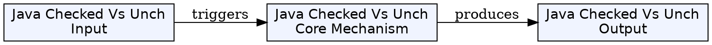
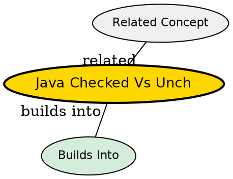

## What's Being Compared

Checked exceptions (subclasses of `Exception` but not `RuntimeException`) versus unchecked exceptions (`RuntimeException` and its subclasses). The distinction determines whether the compiler enforces handling or not -- and has been controversial since Java's inception.

## The Core Tension

Checked exceptions provide compile-time safety by forcing callers to handle predictable failures, but they create coupling -- changing a method's checked exceptions breaks all callers. Unchecked exceptions are flexible and don't clutter signatures, but can be silently ignored until runtime.

## Comparison

| Dimension | [[java-exception-hierarchy|Checked Exceptions]] | [[java-exception-hierarchy|Unchecked Exceptions]] |
|-----------|--------------|----------------|
| Compiler enforcement | Must be caught or declared | No enforcement |
| When to use | Recoverable external failures (file not found, network down) | Programming mistakes (null pointer, illegal arg) |
| Impact on API | Part of method signature -- changes break clients | Transparent -- no signature impact |
| Propagation | Explicit via `throws` | Automatic up the call stack |
| Examples | IOException, SQLException, ClassNotFoundException | NullPointerException, ArrayIndexOutOfBounds, IllegalArgumentException |

## When to Use Checked Exceptions

- The failure is expected and the caller can reasonably recover
- The operation involves external resources (files, network, database)
- The caller MUST handle the failure (e.g., retry, fallback, notify user)

## When to Use Unchecked Exceptions

- The error indicates a programming mistake (invalid argument, null reference)
- Recovery is impossible or impractical at the call site
- The failure should propagate to a higher-level error handler

## The Insight

The checked/unchecked divide mirrors the distinction between anticipated accidents (checked) and bugs (unchecked). Framework and library APIs trend toward unchecked -- many modern Java libraries (Spring, Hibernate) wrap checked exceptions in runtime exceptions. The Java Language Specification authors themselves have expressed doubts about checked exceptions' effectiveness.

## Visual Explanation

## Semantic Network

## Connections

- [[java-exception-hierarchy|Java Exception Hierarchy]] -- the structural foundation of this comparison
- [[java-try-catch-finally|Try-Catch-Finally]] -- catching checked exceptions
- [[java-throw-throws|Throw and Throws]] -- declaring checked exceptions
- [[java-custom-exceptions|Custom Exceptions]] -- choosing checked vs unchecked when creating exceptions